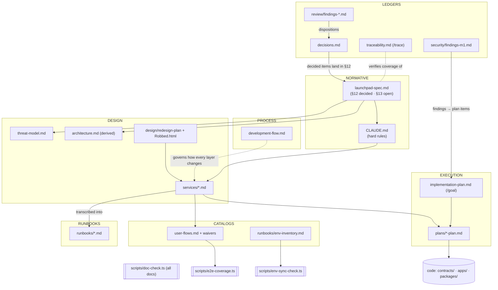

# ROBBED_ — Documentation Map

The authoritative index of every document in this repo: what genre each one is, who owns it, which machines consume it, and how they relate. It **builds on** the authority chain in [`development-flow.md`](development-flow.md) §1 (spec → CLAUDE.md → service docs → code) — nothing here changes that order; this map adds the genre and ownership layer around it. Refreshed 2026-07-12 (docs-taxonomy ratification, decisions.md §14).

**Reading order for anyone new:** [`../launchpad-spec.md`](../launchpad-spec.md) → [`../CLAUDE.md`](../CLAUDE.md) → [`architecture.md`](architecture.md) → [`development-flow.md`](development-flow.md) → [`decisions.md`](decisions.md) → the [`services/`](services/) doc for your area → [`implementation-plan.md`](implementation-plan.md).

## 1. Genre taxonomy

Seven genres. Every doc in the repo is exactly one of these (a directory README states its directory's genre locally).

| Genre | What it is | Lives |
|---|---|---|
| **NORMATIVE** | The rules. Wins every conflict. | `launchpad-spec.md`, `CLAUDE.md` — repo root, paths frozen (hooks, doc-check, and agents hardcode them) |
| **DESIGN** | What the system *is* — implementable descriptions code must transcribe. | [`architecture.md`](architecture.md), [`services/*.md`](services/), [`threat-model.md`](threat-model.md), [`design/robbed-redesign-plan.md`](design/robbed-redesign-plan.md) (+ the `Robbed.html` mockup asset, path frozen — 40+ code comments cite it) |
| **PROCESS** | How we work — the process contract. | [`development-flow.md`](development-flow.md) |
| **EXECUTION** | What to build and when — checkbox state and task detail. | [`implementation-plan.md`](implementation-plan.md) (the single `/goal` authority), [`plans/*-plan.md`](plans/) (per-service detail) |
| **LEDGERS / REGISTERS** | Append-mostly records of what was decided, found, or verified. | [`decisions.md`](decisions.md), [`traceability.md`](traceability.md), [`security/`](security/), [`review/`](review/) |
| **CATALOGS** | Machine-consumed contracts — a script parses them; format is load-bearing. | [`user-flows.md`](user-flows.md), [`user-flows-waivers.md`](user-flows-waivers.md), [`runbooks/env-inventory.md`](runbooks/env-inventory.md) *(a catalog deliberately housed in `runbooks/` for its script consumer and operator audience)* |
| **RUNBOOKS** | Operational how-to, derived from the docs above. | [`runbooks/*.md`](runbooks/) |

Component READMEs (`contracts/README.md`, `apps/web/e2e/README.md`, `tools/deploy/komodo/README.md`, …) are genre-correct **next to their code** and stay there — they are not part of `docs/`. Completed/superseded planning artifacts move to [`archive/`](archive/) (provenance only, never normative).

## 2. Per-document table

Owner column per development-flow.md §4 plus the P-9 ownership ratifications (implementation-plan Conventions). "Machine consumers" names the script/tool that parses the file — a doc with a machine consumer has a **frozen path**.

| File | Genre | Owner | Machine consumers | Key relationships |
|---|---|---|---|---|
| `../launchpad-spec.md` | NORMATIVE | robbed-architect | `scripts/doc-check.ts` (§-ref resolution target); `.claude` hooks/agents hardcode the path | **Governs everything.** §12 = resolved decisions (fed by decisions.md), §13 = open items |
| `../CLAUDE.md` | NORMATIVE | robbed-architect | Claude Code session bootstrap; `.claude/hooks/check-hard-rules.sh` enforces its hard rules | Distills the spec; read alongside it every task |
| [`architecture.md`](architecture.md) | DESIGN | robbed-architect | — | Derived view of spec + service docs; if it drifts, it gets fixed, it never wins |
| [`services/contracts.md`](services/contracts.md) | DESIGN | robbed-contracts | doc-check named-doc refs; plan verify clauses cite the path | Transcribed by `contracts/**`; economics contract with M0 (`tools/m0`) |
| [`services/indexer.md`](services/indexer.md) | DESIGN | robbed-indexer | same | Transcribed by `apps/indexer`; owns event-family → table shapes |
| [`services/api.md`](services/api.md) | DESIGN | robbed-indexer | same | Transcribed by `apps/api`; §5 module map assigns `packages/shared` content ownership |
| [`services/web.md`](services/web.md) | DESIGN | robbed-frontend | same | Transcribed by `apps/web`; copy rules + e2e matrix source |
| [`threat-model.md`](threat-model.md) | DESIGN (adversarial) | robbed-security | plan verify clauses cite the path | Feeds gate-5 prompts, gate-6 scenarios, gate-10 known-risks (spec §10) |
| [`design/robbed-redesign-plan.md`](design/robbed-redesign-plan.md) | DESIGN (visual) | robbed-architect | — | Source: `Robbed.html` mockup; implemented by robbed-frontend; recorded spec §12.50 |
| [`development-flow.md`](development-flow.md) | PROCESS | robbed-architect | cited by `.claude/agents/*` + commands | The process contract: authority chain, docs-precede-code, ambiguity protocol, ratification |
| [`implementation-plan.md`](implementation-plan.md) | EXECUTION | robbed-architect | `/goal` command (checkbox state authority) | Master plan; per-service plans are detail under it, never a second source of truth |
| [`plans/*-plan.md`](plans/README.md) | EXECUTION | per service agent (plans/README table) | doc-check (unique basenames since 2026-07-12) | Detail keyed to master item IDs (`⇐ M1-8`); master plan wins disagreements |
| [`decisions.md`](decisions.md) | LEDGER | robbed-architect | cited by `.claude/agents/*` + commands | Append-mostly register; decided items land in spec §12, open ones mirror §13 |
| [`traceability.md`](traceability.md) | LEDGER | robbed-architect (via `/trace`) | `/trace` command maintains it | Derived requirements matrix; gaps route to the architect, never patched around |
| [`security/findings-m1.md`](security/findings-m1.md) | LEDGER | robbed-security | plan verify clauses cite the path | Gate register; findings route back to robbed-contracts with dispositions |
| [`review/findings-*.md`](review/README.md) | LEDGER | robbed-architect | — | Disposition worklists feeding decisions.md / spec §12 and plan items |
| [`user-flows.md`](user-flows.md) | CATALOG | robbed-frontend (author) · robbed-architect (ratifier) | **`scripts/e2e-coverage.ts`** (I-5a gate, 44 flows) | Derived from spec §5 + web.md; sanctioned exception to root-architect ownership (P-9) |
| [`user-flows-waivers.md`](user-flows-waivers.md) | CATALOG | same pair | **`scripts/e2e-coverage.ts`** | Companion waiver table; P-7 layer-honesty rules |
| [`runbooks/env-inventory.md`](runbooks/env-inventory.md) | CATALOG (housed in runbooks/) | robbed-architect (P-1) | **`scripts/env-sync-check.ts`** (standalone + doc-check check g + `validate.sh` env-sync stage) | Authoritative per-variable table; `.env.example`s sync against it both directions |
| [`runbooks/deploy.md`](runbooks/deploy.md), [`deploy-komodo-cloudflare.md`](runbooks/deploy-komodo-cloudflare.md), [`environments.md`](runbooks/environments.md) | RUNBOOK | robbed-architect (P-9) | plan verify clauses cite these paths | Operator transcription of deploy/hosting decisions (spec §12.44–46 range, §12.52) |
| [`runbooks/toolchain.md`](runbooks/toolchain.md), [`testnet.md`](runbooks/testnet.md) | RUNBOOK | robbed-contracts (P-9) | same | Foundry/solc pin (O-5) + testnet lifecycle procedures |
| [`runbooks/docker.md`](runbooks/docker.md), [`prod-images.md`](runbooks/prod-images.md) | RUNBOOK | robbed-indexer (P-9) | same | Compose stack + production image procedures |
| [`archive/*`](archive/README.md) | ARCHIVE (ledger annex) | robbed-architect | — | Completed/superseded plans, provenance only; each entry names completion date + superseding record |
| `Robbed.html` | DESIGN asset (not md) | robbed-architect | 40+ code comments in `apps/web` + `apps/api` cite `docs/Robbed.html` — **path frozen** | Mockup source for `design/robbed-redesign-plan.md` |

All of `docs/**/*.md` plus the root docs are additionally checked mechanically by `scripts/doc-check.ts` (links/anchors, §-refs, canonical LP copy, fences, `m0:` constant markers, env-sync) on every CI push.

## 3. Relationship diagram

Arrows read "governs / feeds"; dotted = process/verification relations. The chain `spec → CLAUDE.md → services → plans → code` is the development-flow.md §1 authority order verbatim.

## 4. Rules of the road

**Where a new doc goes** (by genre):

- **NORMATIVE** — never a new file. New rules amend the spec (§12/§13 via the ambiguity protocol) or CLAUDE.md. Both stay at repo root.
- **DESIGN** — a new *service* gets `services/<service>.md` (owned by its agent); product/visual design artifacts go in `design/`; system-wide views amend `architecture.md`.
- **PROCESS** — amend `development-flow.md`; do not fork process docs.
- **EXECUTION** — new master items go in `implementation-plan.md`; per-service detail in `plans/<service>-plan.md`. **Basenames must stay unique across `docs/`** (the `-plan` suffix exists because an `api.md` living in both `plans/` and `services/` broke doc-check named-doc resolution; decisions.md §14).
- **LEDGERS** — decisions → a row in `decisions.md` (spec §12 entry if it amends the spec); security gate findings → `security/`; review dockets → `review/findings-YYYY-MM-DD*.md`. Append-mostly: never rewrite dispositioned rows.
- **CATALOGS** — only with an accompanying script consumer and an architect ratification; document the parse contract in the file header (see `user-flows.md`).
- **RUNBOOKS** — `runbooks/<topic>.md`, authored by the owning item's agent per P-9, architect ratifies.
- **Completed/superseded plans** — move to `archive/` with completion date + superseding pointer; update all inbound references (grep) in the same change.

**Ownership rule:** `docs/*.md` at the docs root is **architect-owned**, with exactly these sanctioned exceptions: the `user-flows.md` + `user-flows-waivers.md` pair (frontend-authored, architect-ratified — P-9, development-flow.md §4) and per-service ownership inside `services/`, `plans/`, and `runbooks/` as tabled above. Component READMEs belong next to their code, not in `docs/`.

**Frozen paths (machine/verify consumers):** `launchpad-spec.md`, `CLAUDE.md`, `README.md` (root); `docs/user-flows.md` + `docs/user-flows-waivers.md`; `docs/runbooks/env-inventory.md`; `docs/implementation-plan.md`, `docs/decisions.md`, `docs/traceability.md`, `docs/development-flow.md`; `docs/services/*.md`; the runbooks cited by plan verify clauses; `docs/security/findings-m1.md`, `docs/threat-model.md`; `docs/Robbed.html`. Moving any of these requires updating every consumer in the same change and re-running the full verify set (`doc-check`, `env-sync-check`, `e2e:coverage`).

Ground rule unchanged from day one: **the spec wins over every doc here**; `architecture.md`, `decisions.md`, and `traceability.md` are derived views that get fixed if they drift. Process for changing any of this: [`development-flow.md`](development-flow.md).
