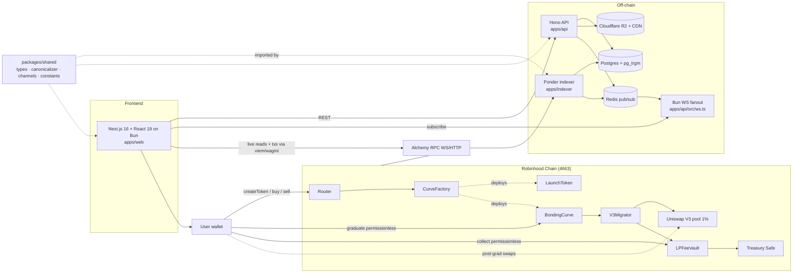

# ROBBED_ — System Architecture

**Status:** Current — describes the shipped / ratified state, 2026-07-12 (post-redesign, §12.50/§12.56/§12.57/§12.58). Entry-point overview for the whole system. Root authority: `docs/spec.md` (v1.2); hard rules distilled in `CLAUDE.md`; per-service designs in `docs/developers/`. When this overview disagrees with a service doc, the service doc wins for that service's internals; when anything disagrees with the spec, the spec wins.

ROBBED_ is a pump.fun-style token launchpad on **Robinhood Chain** (chain ID 4663, Arbitrum Orbit L2, ETH gas, ~100ms blocks, single FCFS sequencer). The product wins on **perceived speed**: bonding-curve tokens are tradeable in well under a second (sequencer inclusion — tracked internally as the `soft_confirmed` tier, but no longer surfaced as a user-facing chip, §12.56), graduating to Uniswap V3 (1% tier) — "LP principal permanently locked; trading fees claimable by treasury" (the canonical LP sentence, spec §12.14). Differentiators vs hood.fun: perceived speed, anti-rug transparency (Top Holders table + safety strip + on-chain metadata commitment, §12.57–§12.58), and a tight **four-page** product — Discover `/`, Token Detail `/t/[address]`, Create `/create`, Portfolio `/portfolio` (§12.50).

---

## 1. System context

## 2. Services

Per-service prose is intentionally thin here — each service's internals are owned by its `developers/*.md`; this section keeps only the system-wide role + pointer.

### Contracts (`contracts/`) — [docs/developers/contracts.md](contracts.md)

Six immutable Solidity contracts (no proxies, one exact compiler pin, OZ v5, MIT) — `LaunchToken`, `CurveFactory`, `BondingCurve`, `Router` (granular `pauseCreates`/`pauseBuys`; **sells can never be paused**), `V3Migrator`, `LPFeeVault`. Drives M1 (security gates 1–4). See contracts.md for the per-contract design.

### Indexer (`apps/indexer`) — [docs/developers/indexer.md](indexer.md)

Ponder over the on-chain event families → Postgres (+`pg_trgm`): the single source of derived truth — venue-continuous candles, `Transfer`-sourced holder balances, confirmation-state watermarks (`soft_confirmed → posted_to_l1 → finalized`), metadata-hash verification, ETH/USD snapshots — with a Redis publish per handler and zero hot-path reads. Drives M2. See indexer.md for the handlers + schema.

### API + WS (`apps/api`) — [docs/developers/api.md](api.md)

Hono on Bun, two processes: HTTP (read endpoints over indexer tables, `pg_trgm` search, API-mediated R2 image upload, server-side metadata canonicalization clients re-verify, moderation gating *listing only*, SIWE admin) and the Bun WS fanout (Redis → sockets). **No chain writes, ever.** Drives M2. See api.md for the endpoint + WS contracts.

### Web (`apps/web`) — [docs/developers/web.md](web.md)

Next.js 16 + React 19 (exact majors, no ranges — §12.37) App Router on Bun; **four pages** — Discover `/`, Token Detail `/t/[address]`, Create `/create`, Portfolio `/portfolio` (read-only, no new tx types — §12.50). wagmi v2 + viem + RainbowKit (chain 4663), TanStack Query patched by one multiplexed WS, `lightweight-charts` venue-continuous candles, Top Holders table + safety strip (§12.57–§12.58), optimistic trade lifecycle reconciled to indexed truth, dark-only. Drives M3. See web.md for the trade lifecycle and confirmation surfacing.

### Shared contracts (`packages/shared`)

Not a service — the interface layer all three consume (see §4).

## 3. End-to-end data flows

### 3.1 Token launch

1. **Web:** creator fills the form; image → `POST /v1/uploads/image` (API sniffs, re-encodes, stores content-addressed on R2, returns `imageUrl` + `imageHash`).
2. **API:** `POST /v1/metadata` canonicalizes the metadata JSON (shared `canonicalizeMetadata`), keccak256-hashes it, stores `metadata/{hash}.json` on R2, returns `{ metadataHash, metadataUri }`. **Web re-computes the hash with the same shared function and refuses to sign on mismatch.**
3. **Wallet → Router:** one tx `createToken(name, symbol, metadataHash, metadataUri, minTokensOut, deadline){value: creationFee + initialBuy}`. Factory CREATE2-deploys token+curve, migrator pre-creates + initializes the V3 pool at the deterministic graduation price (pre-seed defense), optional atomic initial buy executes (anti-self-snipe; anti-sniper cap applies).
4. **Indexer:** `TokenCreated` handler writes the `tokens` row (creator + `creatorFeeBps=0` from day 1), seeds metadata verification, publishes `launch` on `global:launches`; the verifier fetches the R2 JSON, canonicalizes, and compares hashes → metadata-verification verdict.
5. **Web:** the Create stepper advances on sequencer inclusion (<1s), redirects to `/t/[address]`, which renders from optimistic + WS data immediately.

### 3.2 Trade (pre-graduation)

1. **Web:** quote from on-chain `Router.quoteBuy/quoteSell`; user submits `Router.buy/sell` (slippage + deadline always). Sell path reads no pause flag anywhere.
2. **Curve:** fee computed in-contract and **accrued** (never pushed to treasury on the trade path — pull-payment `sweepFees()`, §12.25, so a hostile treasury cannot freeze sells); graduation clamp on buys; emits `Trade(trader, …)` with **post-trade reserves + fee** — the indexer needs no RPC read.
3. **Indexer:** `trades` row (`venue='curve'`), token live-state update, balance upsert (via `Transfer`), candle upsert into all six intervals, Redis publish (`token:{addr}:trades`, `token:{addr}:candles:{interval}`, `global:trades`).
4. **WS → Web:** the optimistic row (rendered at tx-send, with **no** finality claim — the soft tier renders null since §12.56 removed the "Soft-confirmed" chip) reconciles to indexed truth by `txHash`; values are replaced, never dropped. The posted-to-L1 / finalized badges upgrade later via `global:confirmations` watermark broadcasts. Budget: event-to-browser <500ms.

### 3.3 Graduation

1. Final buy is clamped to land net reserves exactly on `GRADUATION_ETH` (excess refunded); curve enters `ReadyToGraduate` — both directions locked (deterministic state, not a pause; UI shows a two-sided "Graduating…" interstitial).
2. Anyone calls `graduate()` (caller reward). Migrator: graduation fee → treasury; wraps ETH; reads `slot0`; **arbs a polluted pool back to the target tick from curve inventory** (bounded; reverts `PoolPriceUnrecoverable` rather than hostile-mint — curve stays retriable); mints the full-range V3 position **to LPFeeVault**; token dust → `0xdEaD`, WETH dust → treasury; emits `Graduated`.
3. **Indexer:** `graduations` row; token flips `graduated`; the pool is registered as a Ponder child source (V3 `Swap` indexing starts now — pre-grad pool activity is never in the price series); publishes `graduated`.
4. **Web:** status pill flips, TradeWidget silently re-engines to Uniswap V3 (QuoterV2 + SwapRouter02), chart continues as **one series** — the pool was initialized at the curve's terminal price, so there is no economic or visual seam. Post-graduation no ROBBED_ contract has any pause authority.

### 3.4 Fee collection

1. Anyone calls `LPFeeVault.collect(tokenId)` (ops cron or altruist); NPM pays accrued V3 fees directly to the treasury Safe; principal mathematically cannot leave.
2. **Indexer:** V3 `Collect` (filtered to vault-held `lp_token_id`s) → `fee_collections`; alerts if recipient ≠ treasury.
3. **API/Web:** `GET /v1/tokens/:address/fees` = collected (indexed) + uncollected (live `tokensOwed` RPC read, cached 60s) — the treasury accrual dashboard.

## 4. Cross-service contracts — who owns what

| Contract surface | Owner (authoritative doc) | Consumers |
|---|---|---|
| Event ABIs (`TokenCreated`, `Trade`, `Graduated`, `GraduationReady`, `FeesSwept`, `PoolInitialized`, `FeesCollected`) — canonical shapes ratified in spec §12.15/§12.25 | robbed-contracts — contracts.md §2 | indexer (handlers), shared `events.ts`, web (receipt parsing) |
| On-chain view surface (`quoteBuy/quoteSell`, `reserves`, `phase`, factory config getters) | robbed-contracts — contracts.md §2.3/§2.4 | web safety strip + holder table + TradeWidget (live reads), API fees endpoint |
| Postgres table shapes | robbed-indexer — indexer.md §3 | API (read-only role), shared `db-rows.ts` |
| WS channel taxonomy + message schemas | robbed-indexer — indexer.md §8.1/§8.2 | WS fanout (api), web; types in shared `channels.ts`/`ws-messages.ts` |
| REST endpoint paths + DTOs (`/v1/...`) | hoodpad-indexer (API doc) — api.md §3 | web; types in shared `api-types.ts` |
| Metadata canonicalization (`canonicalizeMetadata`, `metadataHash`) + golden fixtures | `packages/shared` `metadata.ts` — **single implementation**, api.md §5 | API (hash at publish), web (pre-sign verify), indexer (verify vs chain) |
| Confirmation vocabulary `soft_confirmed \| posted_to_l1 \| finalized` | shared `confirmation.ts` (semantics: spec §2.1, pipeline: indexer.md §5) | all three |
| Constants (chain 4663, WETH, LP sentence, intervals, size caps) | shared `constants.ts` | all three |
| Full read-function ABIs → `packages/shared/src/abi/*.json` (§12.38) — **compilation-time** codegen (`forge build`, no deploy) | hoodpad-contracts (M1-3b) → shared codegen, contracts.md §7.4 | indexer (`curveDefaults()` startup read — spec §12.39 amendment — replaces env-interim), web M3-5 safety-strip live reads (never hand-written) |
| Deploy artifacts → generated **addresses** — **deploy-time** codegen (needs a broadcast) | hoodpad-contracts (M1-14 output) → shared codegen | indexer config, web `lib/addresses.ts` (never hand-edited) |

Change protocol for any row above: the owning doc changes first, consuming agents review, architect signs off — in the docs **before** code (see [CONTRIBUTING.md](../CONTRIBUTING.md)).

## 5. Confirmation states — cross-cutting

Three tiers (spec §2.1): **soft-confirmed** (sequencer inclusion, sub-second — tracked internally; no longer surfaced as a user-facing chip, §12.56), **posted-to-L1** (batch posted), **finalized** (L1 finality). The tier *machinery* is unchanged by the redesign — the indexer still tracks all three. Implementation chain:

- `block.number` is banned on-chain (L1 estimate on Orbit); off-chain we store the L2 block number from logs, which is the real sequence.
- Indexer tracker polls the RPC `safe`/`finalized` tags (~5s), maintains a watermark singleton, and materializes a monotonic `confirmation_state` column on every event table.
- Propagation is O(1): one `confirmations` message on `global:confirmations` per watermark advance; clients upgrade held events locally (spec §12.20). REST returns the materialized column; every event-derived DTO carries `confirmationState`.
- Web surfaces the posted-to-L1 and finalized tiers only (the soft tier renders null since §12.56 removed the "Soft-confirmed" chip, so a fresh trade makes no finality claim); large-value trades (≥1 ETH, §12.47) disclose the tier more prominently. See web.md for the confirmation surfacing.

## 6. Infra topology

| Component | Role | Notes |
|---|---|---|
| Robinhood Chain RPC (Alchemy WS + HTTP) | Ponder realtime sync + backfill; web live reads + tx submission | WS push is the first hop of the <500ms budget |
| Postgres (+`pg_trgm`) | Indexed truth + search; Ponder-managed tables + 4 offchain tables (watermarks, eth-usd, metadata-verifications, moderation) | API has read-only role on indexer tables, read-write only on moderation tables |
| Redis | Pub/sub (indexer → WS fanout), per-channel `seq` counters, rate limiting, moderation job queue | No polling layers anywhere chain→browser |
| Cloudflare R2 + CDN | Content-addressed images (`images/{keccak}.webp`) and canonical metadata (`metadata/{hash}.json`); bucket `robbed-assets`, account `0b1b0b8753489a11d35ee922961f6b72` | R2 is mutable; the on-chain hash is the commitment; indexer re-verifies |
| Treasury | Gnosis Safe (verify/deploy canonical on 4663 — open §13) | Receives all fees; owner of CurveFactory via Ownable2Step; can never touch live curves or the vault |
| Hosting — **backend** (spec §12.45) | Postgres (+`pg_trgm`), Redis, Ponder indexer (Node container), Hono/Bun API + Bun WS fanout — one **docker-compose stack** (`docker-compose.{testnet,mainnet}.yml`) exposed via a **Cloudflare Tunnel** (`cloudflared` service) | Long-running stateful processes; **WS fanout stays co-located** so the Redis→socket hop keeps the <500ms budget (§8). Runbook: `docs/runbooks/docker.md` + `deploy.md` §3 |
| Hosting — **frontend** (spec §12.45) | Next.js 16 SSR on **Cloudflare Workers** via the OpenNext adapter (`@opennextjs/cloudflare`, `nodejs_compat`) — **not** Pages-edge; R2 bound for assets | OpenNext supports Next.js 16 (re-verify at impl time). **OG rendering moves native `@resvg/resvg-js` → WASM** (`@resvg/resvg-wasm`+`satori` or `next/og`), **superseding plan item M3-8's native raster backend for this deploy target** — `workerd` cannot run N-API addons |
| Monitoring (gate 7) | Prometheus-style metrics + alerts: head lag, publish latency, confirmation stalls, invariant violations (double-graduation, fee > cap, collect recipient ≠ treasury) | Mandatory during capped beta |

## 7. Milestone map (spec §11)

| M | Milestone | Driving doc(s) | Gate coverage |
|---|---|---|---|
| M0 | Parameter notebook → `tools/m0/constants.json` (curve constants, graduation tick/sqrtPrice, anti-sniper values, arb-back numbers, caller reward) | contracts.md §4 (consumer contract + schema); `/m0-notebook` command | — |
| M1 | Contracts + testnet deploy | contracts.md (all) | Gates 1–4 |
| M2 | Indexer + API + WS | indexer.md, api.md | Gate-7 metric hooks built in |
| M3 | Frontend (4 pages + Top Holders table / safety strip vs testnet) | web.md | — |
| M4 | LLM audit register, red-team, **capped beta** (mainnet, caps live), bounty | contracts.md §6–7, indexer.md §9.4 | Gates 5–8 |
| M5 | Caps lift (Safe executes `setCaps(max,max)`) | contracts.md §7.2 | Gate 9 decision executed; gate 10 published |
| P2 | Portfolio / creator fees / 4337 | future specs; schema + `creatorFeeBps` slot ready from day 1 | — |

Cross-milestone handoffs: M0→M1 = `constants.json` (schema in contracts.md §4, consistency-asserted by the deploy script); M1→M2 = deploy artifacts + canonical ABIs (spec §12.15) into `packages/shared`; M2→M3 = ratified REST/WS contracts in `packages/shared`; M4→M5 = gate-9 explicit decision.
