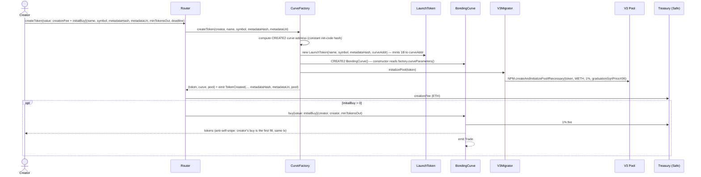
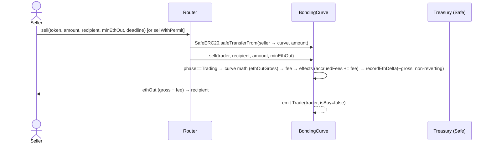
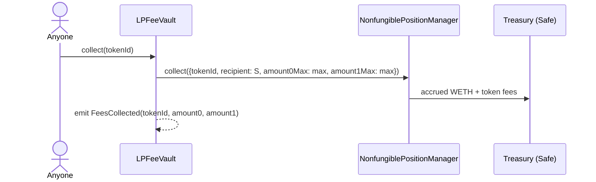

# Service Design — Smart-Contract Layer (`contracts/`)

**Status:** Design v1.0 — drives M1 implementation. Derived from `docs/spec.md` v1.1; where this doc and the spec disagree, the spec wins.
**Owner:** hoodpad-contracts. Audited by hoodpad-security (§10 gates).
**License:** MIT, all contracts. Repo public from day 1.

---

## 1. Purpose & spec coverage

The contract layer is the entire on-chain surface of ROBBED_: token creation, bonding-curve trading, graduation to Uniswap V3, and permanent LP fee capture. Six immutable contracts (no proxies; upgrade = new factory version), one exact compiler pin, deployed to Robinhood Chain (chain ID 4663, Arbitrum Orbit L2).

Architecture template is Gnad.fun (§4.1): Factory → Curve → Token pattern, Router as single user entrypoint, virtual-reserve constant product, custom errors, event taxonomy. Dropped from the template: caller-supplied fees, V2 graduation, bespoke multisig, `^0.8.13` range, `UNLICENSED`.

| Doc section | Implements spec |
|---|---|
| §2 Contract inventory | §4.1, §6 (layout), §6.1 (LaunchToken), §6.2 (BondingCurve), §6.5 (Router), §6.3 (V3Migrator, LPFeeVault), §6.6 (Safe/admin), §7 (creatorFeeBps slot) |
| §3 Key flows | §5.3 (one-tx launch), §6.2–6.3 (trade/graduate), §6.3.2 (pre-seed defense), §6.3.4 (fee collection), §8.3 (metadataHash) |
| §4 Economics & parameters | §6.4 (economics table), §2 (no hardcoded market metrics), M0 milestone (§11) |
| §5 Guards & failure modes | §2 (`block.number` prohibition), §6.5 (anti-sniper, granular pauses, slippage/deadline, CEI), §4.1 (in-contract fees) |
| §6 Testing obligations | §10 gates 1–4 (static, unit/fuzz/invariant, fork, mutation) |
| §7 Deployment & verification | §6.7 (compiler pin, Blockscout), §6.6 (Safe as owner), §10 gate 7 (beta caps) |
| §8 Open items | §13, plus ambiguities found while writing this doc (routed to hoodpad-architect for §12) |

---

## 2. Contract inventory

```
contracts/
├── src/
│   ├── LaunchToken.sol          // OZ ERC20 + ERC20Permit, fixed 1B, ownerless, metadataHash
│   ├── CurveFactory.sol         // deploys token+curve (CREATE2), global config, hard caps, beta caps
│   ├── BondingCurve.sol         // virtual-reserve constant product, in-contract fees, graduation trigger
│   ├── Router.sol               // single user entrypoint: create/buy/sell(+permit), guards
│   ├── V3Migrator.sol           // pool init at creation; graduation: verify/arb-back, mint LP, NFT → vault
│   ├── LPFeeVault.sol           // immutable, collect()-only to fixed treasury (~50 lines)
│   ├── interfaces/
│   │   ├── ILaunchToken.sol
│   │   ├── IBondingCurve.sol
│   │   ├── ICurveFactory.sol
│   │   ├── IV3Migrator.sol
│   │   ├── ILPFeeVault.sol
│   │   └── external/            // minimal local interfaces, no upstream npm deps for these
│   │       ├── IWETH9.sol
│   │       ├── IUniswapV3Factory.sol         // getPool, createPool
│   │       ├── IUniswapV3Pool.sol            // slot0, swap, initialize, liquidity
│   │       ├── IUniswapV3SwapCallback.sol
│   │       ├── INonfungiblePositionManager.sol  // mint, collect, createAndInitializePoolIfNecessary
│   │       └── IArbSys.sol                   // arbBlockNumber() at address(100)
│   ├── errors/
│   │   └── Errors.sol           // all custom errors, shared free-standing declarations
│   └── libs/
│       ├── CurveMath.sol        // pure buy/sell math (mutation-testing target, gate 4)
│       ├── TickMath.sol         // vendored Uniswap 0.8-compatible port (see §7.1)
│       └── FullMath.sol         // vendored Uniswap 0.8-compatible port
├── test/  (unit/, fuzz/, invariant/, fork/)
├── script/ (Deploy.s.sol + config loader for tools/m0/out/constants.json)
└── foundry.toml
```

Every file: `// SPDX-License-Identifier: MIT` and `pragma solidity 0.8.35;` (exact, no `^`, no `>=`). Custom errors only — no revert strings anywhere. NatSpec on all external/public functions.

**Trust topology.** Users interact only with `Router` (and read-only with everything). `BondingCurve` accepts calls only from `Router` (trades) and anyone (`graduate()`). `V3Migrator` accepts calls only from registered curves (`migrate`) and the factory (`initializePool`). `LPFeeVault` accepts `collect()` from anyone. Admin (Ownable2Step, owner = Gnosis Safe) exists only on `CurveFactory`; `Router`, curves, tokens, migrator, and vault have **no owner**. The owner can never touch live-curve economics, token supply, or the vault (§6.6).

### 2.1 LaunchToken.sol (§6.1, §8.3)

Plain OZ v5 `ERC20` + `ERC20Permit`. 18 decimals. No owner, no mint/burn functions, no hooks, no taxes, no blacklist. Supply minted exactly once, in the constructor, to the curve.

**Constructor**

```solidity
/// @param name_         Token name (validated by factory).
/// @param symbol_       Ticker, ≤10 bytes (validated by factory).
/// @param metadataHash_ keccak256 of the canonicalized metadata JSON (§8.3). Immutable commitment.
/// @param curve_        BondingCurve address; receives the full 1,000,000,000e18 supply.
constructor(string memory name_, string memory symbol_, bytes32 metadataHash_, address curve_)
    ERC20(name_, symbol_) ERC20Permit(name_)
```

Constructor body: `metadataHash = metadataHash_; _mint(curve_, TOTAL_SUPPLY);`

**Storage**

| Variable | Type | Mutability |
|---|---|---|
| `metadataHash` | `bytes32` | `immutable`, public |
| `TOTAL_SUPPLY` | `uint256` constant = `1_000_000_000e18` | `constant`, public |
| (OZ ERC20/Permit slots) | — | standard |

**External surface beyond OZ:** `metadataHash()` (auto-getter). Nothing else. No events beyond ERC20 `Transfer`/`Approval` (mint emits `Transfer(0x0 → curve)`).

**Errors:** none of its own (factory validates inputs before deploy).

**Invariants owned:** `totalSupply() == 1e27` forever; no code path changes it. `metadataHash` immutable.

**Note on "burning":** the token has no `burn()` (spec: "no mint/burn"). Dust burning at graduation is implemented as transfer to `0x000000000000000000000000000000000000dEaD` (see §3.4 step 9; ratified in spec §12.13 — token leg only, WETH dust → treasury).

### 2.2 CurveFactory.sol (§6, §6.4, §6.6, §10 gate 7)

Deploys token+curve pairs, holds global config within code-enforced hard caps, tracks the curve registry, enforces beta TVL caps. `Ownable2Step`; owner = Gnosis Safe.

**Deployment pattern (CREATE2 + staged parameters).** The token constructor mints to the curve, and the curve constructor needs the token address — resolved Uniswap-style:

1. `curveAddr = computeCreate2Address(salt, keccak256(type(BondingCurve).creationCode))` where `salt = keccak256(abi.encode(creator, tokenCounter))`. `BondingCurve` takes **no constructor args** — it reads `ICurveFactory(msg.sender).curveParameters()` in its constructor, so the init-code hash is constant and the address is precomputable.
2. Deploy `LaunchToken(name, symbol, metadataHash, curveAddr)` (plain CREATE) — supply lands at the not-yet-deployed curve address.
3. Write the staged `CurveParameters` storage struct (token, router, migrator, snapshot of all curve economics), CREATE2-deploy `BondingCurve` at `curveAddr`, delete the staged struct. (Plain storage staging, not transient storage — gas is irrelevant here and it keeps transient storage `TSTORE`/`TLOAD` deliberately unused, per §12.44; the `cancun` target relies on `mcopy` only.)
4. Call `migrator.initializePool(token)` → creates + initializes the V3 1% pool at the deterministic graduation price (§6.3.2). Returns `pool`.
5. Register: `curveOf[token] = curve; isCurve[curve] = true; tokenOf[curve] = token;`
6. Emit `TokenCreated`.

**External/public functions**

```solidity
/// @notice Deploys a LaunchToken + BondingCurve pair and pre-initializes its V3 pool.
///         Only callable by the Router (which collects the creation fee and runs guards).
/// @dev Validates: bytes(name).length in [1,32], bytes(symbol).length in [1,10],
///      metadataHash != bytes32(0), bytes(metadataUri).length in [1,256], !pauseCreates.
///      metadataUri (R2 canonical JSON URL) is event-only — not stored on-chain; the
///      integrity commitment is metadataHash (§8.3). Required by the indexer (§12.15).
function createToken(address creator, string calldata name, string calldata symbol,
                     bytes32 metadataHash, string calldata metadataUri)
    external onlyRouter returns (address token, address curve, address pool);

/// @notice Curve callback: registers net curve-ETH delta for the global beta TVL cap.
/// @dev onlyCurve. On buys: reverts CapExceeded if globalCurveEth would exceed globalEthCap.
///      On sells/graduation the delta is negative and NEVER reverts (sells must always succeed;
///      use unchecked-floor-at-zero semantics rather than underflow revert).
function recordEthDelta(int256 delta) external onlyCurve;

// ── Views ──
function curveParameters() external view returns (CurveParameters memory); // staged, only mid-deploy
function curveOf(address token) external view returns (address);
function tokenOf(address curve) external view returns (address);
function isCurve(address account) external view returns (bool);
function config() external view returns (FactoryConfig memory);   // operational config snapshot (12 fields — §12.39 amendment)
function curveDefaults() external view returns (CurveDefaults memory); // immutable curve-shape defaults (§12.38/§12.39)
function globalCurveEth() external view returns (uint256);

// ── Owner (Safe) — every setter emits an event; every value hard-capped in code ──
function setPauseCreates(bool paused) external onlyOwner;
function setPauseBuys(bool paused) external onlyOwner;
function setTreasury(address newTreasury) external onlyOwner;              // != address(0)
function setTradeFeeBps(uint16 newBps) external onlyOwner;                 // treasury leg; newBps + creatorFeeBps ≤ 200; FUTURE curves only
function setCreatorFeeBps(uint16 newBps) external onlyOwner;               // creator leg (§7/§12.63); tradeFeeBps + newBps ≤ 200; FUTURE curves only
function setCreatorVault(address vault) external onlyOwner;                // ONE-TIME (§12.63): reverts AlreadyInitialized; != address(0)
function setCreationFee(uint256 newFee) external onlyOwner;                // ≤ maxCreationFee (immutable)
function setGraduationFee(uint256 newFee) external onlyOwner;              // ≤ maxGraduationFee (immutable); future curves only
function setCallerReward(uint256 newReward) external onlyOwner;            // ≤ maxCallerReward (immutable); future curves only
function setAntiSniper(uint64 windowSeconds, uint128 maxEarlyBuyWei) external onlyOwner; // future curves only; windowSeconds ≤ MAX_EARLY_WINDOW_SECONDS (7 days) else EarlyWindowTooLong
function setCaps(uint128 perTokenEthCap, uint128 globalEthCap) external onlyOwner;       // beta caps; BOTH ≥ graduationEth else CapBelowGraduation; lift = set to type(uint128).max
function setRouter(address router_) external onlyOwner;                    // ONE-TIME: reverts AlreadyInitialized if set
function setMigrator(address migrator_) external onlyOwner;                // ONE-TIME: reverts AlreadyInitialized if set
```

**Config-discipline bounds (owner setters + constructor — 2026-07-13).** Two low-severity audit findings closed the gap between the fee setters (already ceiling-checked) and the cap/anti-sniper setters (previously unbounded):

- **`setCaps` / constructor** — both `perTokenEthCap` and `globalEthCap` must be **≥ `graduationEth`** (`CapBelowGraduation` otherwise), enforced by the shared `_requireCapsReachGraduation` helper. A cap below the graduation threshold makes graduation permanently UNREACHABLE (a buy can never push real reserves to `GRADUATION_ETH` once the cap binds below it) — the check guards §12.11 reachability. `globalEthCap` bounds the SUM across curves, so it too must clear a single curve's threshold for ANY curve to graduate. **Only the graduation floor is enforced, NOT the mutual ordering** — `perTokenEthCap` may legitimately EXCEED `globalEthCap` (a non-binding per-token limit, e.g. `setCaps(max, 10 ether)`). The M5 caps-lift value `type(uint128).max` trivially satisfies the floor. The deploy script mirrors the same assertion pre-broadcast (`Deploy._consistencyChecks`, `CapBelowGraduation(cap, graduationEth)`).
- **`setAntiSniper`** — `windowSeconds ≤ MAX_EARLY_WINDOW_SECONDS` (a `uint64 public constant` = **7 days**; `EarlyWindowTooLong` otherwise). The early-buy window is a short front-running device (M0 = 8s); 7 days is an astronomically generous ceiling (≈75_600× the calibrated value) that ALSO keeps the `uint64` `createdAt + earlyWindowSeconds` sum in the curve constructor from ever overflowing (`block.timestamp` ~1.7e9 + 6.05e5 ≪ 1.8e19), so the setter can never brick `createToken`. `maxEarlyBuyWei` is deliberately left unbounded — a larger value only WEAKENS the buy-only early cap and can never block a sell.

**Config mutability model (§6.4 "existing curves immutable"):**

- **Snapshotted into each curve at creation** (owner changes affect future launches only): `virtualEth0`, `virtualToken0`, `curveSupply`, `lpTranche`, `graduationEth`, `tradeFeeBps`, `creatorFeeBps` (§7/§12.63 — configurable, default 0; mainnet 0, testnet 50), `creator`, `creatorVault`, `graduationFee`, `callerReward`, `earlyWindowSeconds`, `maxEarlyBuyWei`.
- **Read live from the factory at call time** (operational, never blocks sells, never alters economics): `treasury` (fee destination), `pauseBuys` (buy-side kill switch), `perTokenEthCap` / `globalEthCap` (beta risk caps, buy-side only).

**Factory read surface (ratified — spec §12.39, amended 2026-07-12: SPLIT surface is canonical).** The current-config read consumed by Router, the UI/Trust-panel, and the indexer startup read (§12.38) spans three legs — **no invented fields, nothing unreadable**: (1) **`config()` → `FactoryConfig`** — the 12 owner-settable operational fields only; (2) **`curveDefaults()` → `CurveDefaults`** — the five immutable curve-shape defaults; the canonical pre-create economics read (Create-page preview, indexer startup cache — safe before any curve exists, unlike `curveParameters()` which is all-zero outside `createToken`); (3) **dedicated getters** — `router()`, `migrator()`, `weth()`, `treasury()`, plus the setter ceilings `maxCreationFee`/`maxGraduationFee`/`maxCallerReward` as `public immutable` (constructor-asserted, incl. `maxCallerReward + maxGraduationFee < graduationEth` → `GraduationUnfundable`). The §12.40d caveat stands across all three legs: these values are *factory-current* — an owner `setTradeFeeBps`/`setGraduationFee`/… affects **future curves only**, so per-token live economics (e.g. an older curve's `TRADE_FEE_BPS`) are read from **that curve**, never from the factory. Both structs are separate from `CurveParameters` (the staged per-curve deploy struct, valid only mid-`createToken`).

```solidity
struct FactoryConfig {
    // operational, owner-settable (govern future curves for snapshotted economics)
    address treasury;             // fee destination (read live by curves)
    uint16  tradeFeeBps;          // treasury leg; tradeFeeBps + creatorFeeBps ≤ 200
    uint16  creatorFeeBps;        // creator leg (§7/§12.63): default 0, configurable, additive under the cap
    uint256 creationFee;
    uint256 graduationFee;
    uint256 callerReward;
    uint64  earlyWindowSeconds;
    uint128 maxEarlyBuyWei;
    bool    pauseCreates;         // blocks Router.createToken only
    bool    pauseBuys;            // blocks buys only — NEVER sells
    uint128 perTokenEthCap;       // beta cap, buy-side only
    uint128 globalEthCap;         // beta cap, buy-side only
}

struct CurveDefaults {
    // immutable curve-shape defaults — new shape = new factory version (§6)
    uint256 virtualEth0;
    uint256 virtualToken0;
    uint256 curveSupply;
    uint256 lpTranche;
    uint256 graduationEth;
}
```

The landed M1-8 implementation diverged from the original single-struct itemization (one `FactoryConfig` also carrying addresses, ceilings, and curve shape); the divergence was reported per this section's rule and the split surface re-ratified as canonical on 2026-07-12 (spec §12.39 amendment — the frozen 12-field `config()` ABI was already consumed by indexer/web via the §12.38 shared codegen ABIs, and every itemized field remains on-chain readable).

**Storage**

| Variable | Type | Mutability |
|---|---|---|
| `router` | `address` | one-time-set, then effectively immutable |
| `migrator` | `address` | one-time-set, then effectively immutable |
| `weth` | `address` | `immutable` = `0x0Bd7D308f8E1639FAb988df18A8011f41EAcAD73` (constructor param, asserted in deploy script) |
| `maxCreationFee`, `maxGraduationFee`, `maxCallerReward` | `uint256` | `immutable` (deploy-time ceilings for admin setters) |
| `MAX_TRADE_FEE_BPS` | `uint16` constant = `200` | `constant` (§6.4 hard cap ≤2%) |
| `treasury` | `address` | storage, owner-settable |
| `creatorVault` | `address` | one-time-set (§12.63), then effectively immutable; required non-zero only for a launch with `creatorFeeBps != 0` |
| `tradeFeeBps` | `uint16` | storage, owner-settable; `tradeFeeBps + creatorFeeBps ≤ 200`; init from constants.json (100) |
| `creatorFeeBps` | `uint16` | storage, owner-settable via `setCreatorFeeBps` (§7/§12.63); default 0, ADDITIVE under the ≤200 cap; snapshotted per curve |
| `creationFee`, `graduationFee`, `callerReward` | `uint256` | storage, owner-settable ≤ immutables |
| `earlyWindowSeconds` | `uint64` / `maxEarlyBuyWei` `uint128` | storage, owner-settable |
| `pauseCreates`, `pauseBuys` | `bool` | storage, owner-settable. **No `pauseSells` exists.** |
| `perTokenEthCap`, `globalEthCap` | `uint128` | storage, owner-settable |
| `globalCurveEth` | `uint256` | storage, curve-updated |
| `curveOf`, `tokenOf`, `isCurve` | mappings | append-only |
| `tokenCounter` | `uint256` | monotonic salt input |
| `_stagedParams` | `CurveParameters` | transient-by-convention (written+deleted within `createToken`) |
| Curve economics defaults (`virtualEth0` etc.) | `uint256` each | storage, owner-settable? → **No.** `internal immutable`, from constants.json; exposed via `curveDefaults()` (§12.39 amendment). Changing curve shape = new factory version (§6). |

**Events**

```solidity
event TokenCreated(address indexed token, address indexed curve, address indexed creator,
                   string name, string symbol, bytes32 metadataHash, string metadataUri,
                   address pool); // canonical shape, §12.15
event TreasuryUpdated(address indexed newTreasury);
event TradeFeeUpdated(uint16 newBps);
event CreationFeeUpdated(uint256 newFee);
event GraduationFeeUpdated(uint256 newFee);
event CallerRewardUpdated(uint256 newReward);
event AntiSniperUpdated(uint64 windowSeconds, uint128 maxEarlyBuyWei);
event CapsUpdated(uint128 perTokenEthCap, uint128 globalEthCap);
event PauseCreatesSet(bool paused);
event PauseBuysSet(bool paused);
event RouterSet(address router);
event MigratorSet(address migrator);
event CreatorFeeUpdated(uint16 newBps);   // §7/§12.63 creator-leg default for future curves
event CreatorVaultSet(address vault);     // §12.63 one-time CreatorVault wiring
```

**Errors:** `NotRouter()`, `NotCurve()`, `AlreadyInitialized()`, `ZeroAddress()`, `InvalidName()`, `InvalidSymbol()`, `ZeroMetadataHash()`, `CreatesPaused()`, `FeeAboveCap()`, `CapExceeded()`, `CreatorVaultUnset()` (§12.63 — a launch with `creatorFeeBps != 0` while the vault is unwired).

**Invariants owned:** registry append-only; **`tradeFeeBps + creatorFeeBps ≤ 200` unconditionally** (the ADDITIVE §6.4/§12.63 ≤2% cap — constructor + both setters); creator-leg curves fail-closed unless the CreatorVault is wired; global cap accounting never blocks an ETH-decreasing operation.

### 2.3 BondingCurve.sol (§6.2, §6.5 anti-sniper, §6.4)

One instance per token. Holds the full 1B token supply at birth and all raised ETH. Virtual-reserve constant product; **fees computed here, in-contract** (§6.2: "1% ETH-leg fee to treasury before curve math"). Only the Router may call trade functions; `graduate()` is permissionless.

**Curve math (libs/CurveMath.sol, pure):**

- `k = virtualEthReserves × virtualTokenReserves` (recomputed per trade; rounding drifts it upward only — the gate-2 invariant).
- **Buy** (net ETH in `e`): `tokensOut = vT − ceilDiv(vE·vT, vE + e)`; then `vE += e; vT −= tokensOut`. Rounds tokensOut **down** (protocol-favoring).
- **Sell** (tokens in `t`): `ethOutGross = vE − ceilDiv(vE·vT, vT + t)`; then `vT += t; vE −= ethOutGross`. Rounds ethOut **down**.
- Fee (pull-payment, §12.25 + Phase-2 creator leg §7/§12.63): **TWO additive ETH-leg fees, both floored independently, both accrued in-contract** — the treasury leg `fee = floor(x · tradeFeeBps / 10_000) → accruedFees` and the creator leg `creatorFee = floor(x · creatorFeeBps / 10_000) → accruedCreatorFees`, where `x = msg.value` on buys (net `e = msg.value − fee − creatorFee`, **before** curve math) and `x = ethOutGross` on sells (`ethOut = ethOutGross − fee − creatorFee`, after the token-leg curve math). `tradeFeeBps + creatorFeeBps ≤ 200` is guaranteed by the factory. On the **graduation clamp** the accepted gross is `min(grossIn, ceilDiv(remaining · 1e4, 1e4 − totBps))` — the `min` guards the two-floor rounding case where the ceilDiv would exceed `grossIn` (F-1) — and the residual `totalFee = acceptedGross − net` is split proportionally: `creatorFee = floor(totalFee · creatorFeeBps / totBps)`, `fee = totalFee − creatorFee`. At `creatorFeeBps == 0` the creator term is 0 everywhere and every path is byte-identical to the treasury-only build. **No trade path ever calls the treasury, the creator, OR the vault** — this is what makes buys/sells un-freezable by construction against BOTH a hostile treasury (§12.25) and a hostile creator (§12.63); each leg is pulled out by its own permissionless sweep (`sweepFees()` / `sweepCreatorFees()`) below.
- All reserve math in `uint256`; `vE·vT` for launch-scale values (vT ≤ ~1.073e27, vE ≤ ~few hundred ETH) cannot overflow 2^256; CurveMath still uses checked arithmetic except documented `unchecked` blocks with proofs in comments.

**Graduation-boundary clamp.** A buy may not push `realEthReserves` past `GRADUATION_ETH`. If it would: accept `acceptedNet = GRADUATION_ETH − realEthReserves`, recompute `acceptedGross = ceilDiv(acceptedNet · 10_000, 10_000 − tradeFeeBps)`, `fee = acceptedGross − acceptedNet`, refund `msg.value − acceptedGross` to `refundTo`. `minTokensOut` is checked against the actual `tokensOut` — a clamped fill that undershoots the min reverts (`SlippageExceeded`), it does not silently partial-fill below the user's floor. The buy that lands exactly on `GRADUATION_ETH` sets `phase = ReadyToGraduate` and emits `GraduationReady`.

**Lifecycle:** `enum Phase { Trading, ReadyToGraduate, Graduated }`. `Trading`: buys+sells open. `ReadyToGraduate`: curve locked (both directions) pending permissionless `graduate()` — this is a deterministic protocol state, not a pause (no authority can cause or extend it; anyone can exit it by calling `graduate()`); ratified in spec §12.12. `Graduated`: terminal; curve holds zero value; every state-mutating function reverts.

**External/public functions**

```solidity
/// @notice Buy tokens with ETH (net of in-contract fee). Router-only.
/// @dev msg.value is the gross ETH. Order: phase check → anti-sniper cap → fee calc →
///      graduation clamp → factory.recordEthDelta(+acceptedNet) (global cap; reverts if exceeded) →
///      per-token cap check → curve math → state update → accruedFees += fee (NO treasury call) →
///      CEI interactions (refund→refundTo, tokens→recipient) → Trade event → GraduationReady if crossed.
/// @param trader      The originating EOA (Router forwards msg.sender) — emitted as Trade.trader (§12.15).
/// @param recipient   Receives tokens.
/// @param refundTo    Receives any graduation-clamp refund (Router passes original payer).
/// @param minTokensOut Slippage floor; revert SlippageExceeded if actual < min.
function buy(address trader, address recipient, address refundTo, uint256 minTokensOut)
    external payable onlyRouter returns (uint256 tokensOut, uint256 acceptedEthGross, uint256 fee);

/// @notice Sell tokens for ETH. Router-only. Router MUST transfer `tokenAmount` from the seller
///         to this curve in the same call, before invoking sell (internal trust, onlyRouter).
/// @dev Never reads pauseBuys/pauseCreates or any factory pause state, and NEVER calls the treasury
///      (fee accrues to accruedFees) — sells cannot be paused or frozen by construction (§12.25).
///      Reverts only on: phase != Trading, zero amount, or SlippageExceeded.
///      factory.recordEthDelta(-ethOutGross) uses non-reverting floor-at-zero semantics.
/// @param trader      The seller EOA (Router forwards msg.sender) — emitted as Trade.trader.
function sell(address trader, address recipient, uint256 tokenAmount, uint256 minEthOut)
    external onlyRouter returns (uint256 ethOut, uint256 fee);

/// @notice Permissionless, non-phase-gated pull-payment of accrued trade fees to the treasury (§12.25).
/// @dev nonReentrant. Reads `treasury` live from the factory, sends the full `accruedFees` via low-level
///      call (EthTransferFailed on revert), zeroes accruedFees first (CEI). Works in EVERY phase incl.
///      Graduated (so fees left in the curve at graduation are still claimable). Touches NO curve reserve.
///      A reverting treasury only reverts THIS call (retriable) — it can never block a buy or sell.
function sweepFees() external nonReentrant returns (uint256 swept);

/// @notice Permissionless, non-phase-gated pull-payment of the accrued CREATOR leg to the CreatorVault (§12.63).
/// @dev nonReentrant, CEI. Zeroes `accruedCreatorFees` first, then pushes to `CreatorVault.deposit{value}(creator)`.
///      The vault deposit is a TRUSTED, non-reverting accumulate, so this ALWAYS clears the escrow regardless of
///      creator behavior — a hostile creator can only revert its own downstream `CreatorVault.claim`, never this
///      sweep and never a trade. No-op (sends nothing) at `CREATOR_FEE_BPS == 0`. Works in EVERY phase.
function sweepCreatorFees() external nonReentrant returns (uint256 swept);

/// @notice Permissionless graduation once realEthReserves == GRADUATION_ETH (phase ReadyToGraduate).
/// @dev Pays CALLER_REWARD (ETH) to msg.sender, registers factory.recordEthDelta(-int256(realEthReserves))
///      (non-reverting; curve exits the global beta-cap sum), transfers the curve's ENTIRE token balance
///      and (balance − accruedFees − accruedCreatorFees) ETH (donations included, BOTH fee escrows withheld for
///      their sweeps) to the migrator, sets phase = Graduated, calls
///      migrator.migrate{value: balance − reward − accruedFees − accruedCreatorFees}(...).
///      Reverts NotReady if phase != ReadyToGraduate. Fires exactly once (phase is terminal).
function graduate() external nonReentrant;

// ── Views (Trust panel §5.2 + Router quoting) ──
function quoteBuy(uint256 ethInGross) external view
    returns (uint256 tokensOut, uint256 fee, uint256 acceptedEthGross, uint256 refund);
function quoteSell(uint256 tokenAmount) external view returns (uint256 ethOut, uint256 fee);
function reserves() external view returns
    (uint256 virtualEth, uint256 virtualToken, uint256 realEth, uint256 realToken);
function phase() external view returns (Phase);
function createdAt() external view returns (uint64);

receive() external payable; // accepts donations; they are swept into graduation, never credited to reserves
```

**Storage**

| Variable | Type | Mutability |
|---|---|---|
| `token` | `address` | `immutable` (from staged params) |
| `router`, `factory`, `migrator` | `address` | `immutable` |
| `VIRTUAL_ETH_0`, `VIRTUAL_TOKEN_0` | `uint256` | `immutable` |
| `CURVE_SUPPLY` (≈793.1M e18), `LP_TOKEN_TRANCHE` (≈206.9M e18) | `uint256` | `immutable` |
| `GRADUATION_ETH` | `uint256` | `immutable` (net-of-fee real reserves — ratified, spec §12.11) |
| `TRADE_FEE_BPS` | `uint16` | `immutable` (treasury leg, snapshot; `TRADE_FEE_BPS + CREATOR_FEE_BPS ≤ 200`) |
| `CREATOR_FEE_BPS` | `uint16` | `immutable` (creator leg, snapshot §7/§12.63; 0 on v1/mainnet) |
| `creator`, `creatorVault` | `address` | `immutable` (snapshot §12.63; creator = fee beneficiary, vault = pull-payment sink) |
| `GRADUATION_FEE`, `CALLER_REWARD` | `uint256` | `immutable` |
| `EARLY_WINDOW_END` | `uint64` | `immutable` = `createdAt + earlyWindowSeconds` |
| `MAX_EARLY_BUY` | `uint128` | `immutable` (gross ETH per buy tx during window) |
| `createdAt` | `uint64` | `immutable` = `block.timestamp` at deploy |
| `virtualEthReserves`, `virtualTokenReserves` | `uint256` | storage |
| `realEthReserves`, `realTokenReserves` | `uint256` | storage (`realToken` = tokens still available for sale, init `CURVE_SUPPLY`) |
| `accruedFees` | `uint256` | storage — unswept treasury ETH-leg fees (§12.25) |
| `accruedCreatorFees` | `uint256` | storage — unswept creator ETH-leg fees (§7/§12.63); `balance ≥ realEthReserves + accruedFees + accruedCreatorFees` always |
| `phase` | `Phase` (uint8) | storage |

**Anti-sniper (§6.5, rewritten per §2):** if `block.timestamp < EARLY_WINDOW_END`, require `msg.value ≤ MAX_EARLY_BUY` else revert `EarlyBuyCapExceeded`. **Timestamp-based, chosen over `arbBlockNumber` (both spec-sanctioned)** because a seconds-window is deployment-constant while block cadence is a marketing figure; `IArbSys` interface is still shipped for tests and any future block-window need. `block.number` appears nowhere in `src/` (grep-enforced in CI and in the pre-report self-check).

**Events**

```solidity
/// Emitted by the curve (indexer registers curves as Ponder factory children via TokenCreated).
event Trade(address indexed trader, bool indexed isBuy, uint256 ethAmount /* gross */,
            uint256 tokenAmount, uint256 fee, uint256 virtualEthReserves,
            uint256 virtualTokenReserves, uint256 realEthReserves);
event GraduationReady(uint256 realEthReserves);
event FeesSwept(address indexed treasury, uint256 amount); // §12.25 pull-payment (treasury leg)
event CreatorFeesSwept(address indexed creator, address indexed vault, uint256 amount); // §12.63 creator leg → vault
```

(Post-trade reserve fields make candle/progress indexing stateless for Ponder.)

**Errors:** `NotRouter()`, `NotTrading()`, `NotReady()`, `ZeroAmount()`, `SlippageExceeded(uint256 actual, uint256 min)`, `EarlyBuyCapExceeded(uint256 sent, uint256 cap)`, `PerTokenCapExceeded()`, `EthTransferFailed()`.

**Invariants owned (gate 2, §12.63-extended):** `k` non-decreasing across any trade sequence; **`address(this).balance ≥ realEthReserves + accruedFees + accruedCreatorFees` always** (solvency, §12.25/§12.63); every circulating token amount is sellable for a payable amount while `phase == Trading`, **regardless of the treasury OR creator address's behavior** (no trade path calls the treasury, the creator, or the vault); `realEthReserves ≤ GRADUATION_ETH` always; graduation fires exactly once; post-graduation the curve holds **zero reserve/LP value** — `realEthReserves == 0` and `realToken == 0`, and any residual ETH is exactly `accruedFees + accruedCreatorFees`, drained to 0 by `sweepFees` + `sweepCreatorFees` (§12.25/§12.63).

### 2.4 Router.sol (§6.5, §7)

Single user entrypoint. Thin by design: deadline + pause guards + fund plumbing + permit; all economics live in the curve. `ReentrancyGuard` on every external state-mutating function; CEI throughout. **No owner** — all config is read from the factory.

```solidity
/// @notice One-tx launch: create token + curve + pre-initialized V3 pool, optionally atomic
///         initial buy with the remaining msg.value (anti-self-snipe, §5.3).
/// @dev msg.value = factory.creationFee() + optional initialBuy. Creation fee → treasury.
///      If initialBuy == 0, minTokensOut MUST be 0 (revert InvalidMsgValue otherwise).
///      Reverts CreatesPaused if factory.pauseCreates(). metadataHash + metadataUri emitted
///      via factory's TokenCreated (§12.15).
function createToken(string calldata name, string calldata symbol, bytes32 metadataHash,
                     string calldata metadataUri, uint256 minTokensOut, uint256 deadline)
    external payable nonReentrant checkDeadline(deadline)
    returns (address token, address curve, uint256 tokensOut);

/// @notice Buy on the bonding curve. Reverts BuysPaused if factory.pauseBuys().
/// @dev Forwards curve.buy(trader = msg.sender, recipient, refundTo = msg.sender, minTokensOut).
function buy(address token, address recipient, uint256 minTokensOut, uint256 deadline)
    external payable nonReentrant checkDeadline(deadline) returns (uint256 tokensOut);

/// @notice Sell on the bonding curve. Reads NO pause flag of any kind — greppable by auditors:
///         the words pauseBuys/pauseCreates do not appear in this function or anything it calls.
/// @dev Pulls tokenAmount from msg.sender (approval target = Router, one approval covers all curves)
///      directly to the curve via SafeERC20.safeTransferFrom, then
///      curve.sell(trader = msg.sender, recipient, tokenAmount, minEthOut).
function sell(address token, uint256 tokenAmount, address recipient, uint256 minEthOut, uint256 deadline)
    external nonReentrant checkDeadline(deadline) returns (uint256 ethOut);

/// @notice sell() with EIP-2612 permit (LaunchToken is ERC20Permit). try/catch around permit
///         (front-run-permit griefing tolerance: proceed if allowance already sufficient).
function sellWithPermit(address token, uint256 tokenAmount, address recipient, uint256 minEthOut,
                        uint256 deadline, uint8 v, bytes32 r, bytes32 s)
    external nonReentrant returns (uint256 ethOut);

// Views (thin proxies to curve quoting, for FE convenience)
function quoteBuy(address token, uint256 ethInGross) external view
    returns (uint256 tokensOut, uint256 fee, uint256 acceptedEthGross, uint256 refund);
function quoteSell(address token, uint256 tokenAmount) external view returns (uint256 ethOut, uint256 fee);
```

**Storage:** `factory` (`immutable`). Nothing else. No `receive()` — the Router never holds ETH (curve pays recipients and treasury directly; refunds flow curve → refundTo).

**Events:** none of its own (`Trade` on curves, `TokenCreated` on factory keep the indexer surface at two root ABIs + children).

**Errors:** `DeadlineExpired()`, `UnknownToken()`, `InvalidMsgValue()`, `CreatesPaused()`, `BuysPaused()`, `ZeroAddress()`.

**Access control:** none (public entrypoint). Fees: **never caller-supplied** — no fee parameter exists in any signature (§4.1); **BOTH ETH-leg fees (treasury §12.25 + creator §7/§12.63) are computed and accrued entirely in the {BondingCurve}** — the Router supplies no fee and holds no creator state.

**Invariants owned:** deadline+slippage present on every trade path incl. create's atomic buy (§6.5); sell path provably pause-free; no ETH ever strands in the Router.

### 2.5 V3Migrator.sol (§6.3, §6.3.2, §12.1)

Stateless-per-token executor for graduation Option B: Uniswap V3, 1% fee tier (tick spacing 200), full-range position, LP NFT → LPFeeVault. Also owns creation-time pool initialization (pre-seed defense). Implements `IUniswapV3SwapCallback`. No owner.

```solidity
/// @notice Called by the factory during createToken. Creates + initializes the token/WETH 1% pool
///         at the deterministic graduation price (§6.3.2).
/// @dev Uses NPM.createAndInitializePoolIfNecessary with sqrtPriceX96 chosen by token ordering:
///      SQRT_PRICE_TOKEN0 if token < WETH else SQRT_PRICE_TOKEN1 (both immutables from M0).
///      If an attacker pre-created the pool at a hostile price, initialization is skipped —
///      tolerated: migrate() never trusts slot0 and will arb it back (defense in depth).
function initializePool(address token) external onlyFactory returns (address pool);

/// @notice Called by a curve's graduate() with the curve's ETH balance minus caller reward and
///         minus unswept `accruedFees` (§12.25), and after receiving the curve's entire token balance.
/// @dev onlyCurve (factory.isCurve(msg.sender)). Full sequence in §3.4. Reverts propagate to
///      graduate(), leaving the curve in ReadyToGraduate for retry.
function migrate(address token) external payable returns (uint256 tokenId, uint128 liquidity);

/// @notice Uniswap V3 swap callback for the arb-back swaps.
/// @dev Reverts NotPool unless msg.sender == the exact pool computed for the in-flight migration
///      (address stored in a transient-style storage slot during migrate, deleted after).
function uniswapV3SwapCallback(int256 amount0Delta, int256 amount1Delta, bytes calldata data) external;
```

**Storage**

| Variable | Type | Mutability |
|---|---|---|
| `factory` (CurveFactory) | `address` | `immutable` |
| `v3Factory`, `positionManager` | `address` | `immutable` (constructor params — open item O-4, §13; never invented) |
| `weth` | `address` | `immutable` = canonical WETH |
| `vault` (LPFeeVault) | `address` | `immutable` |
| `SQRT_PRICE_TOKEN0_X96`, `SQRT_PRICE_TOKEN1_X96` | `uint160` | `immutable` (M0; both token orderings) |
| `TARGET_TICK_TOKEN0`, `TARGET_TICK_TOKEN1` | `int24` | `immutable` (M0) |
| `TOLERANCE_TICKS` | `int24` | `immutable` (M0, e.g. ±10) |
| `MAX_ARB_ITERATIONS` | `uint8` | `immutable` (M0, e.g. 5) |
| `MIGRATION_SLIPPAGE_BPS` | `uint16` | `immutable` (M0; mint amount-mins **and** the symmetric per-leg arb budget — token leg may draw down to `LP_TOKEN_TRANCHE·(1−bps)`, WETH leg may spend `wethForMint·bps`, M-10-A) |
| `FEE_TIER` | `uint24` constant = `10_000`; `TICK_LOWER = -887_200`, `TICK_UPPER = 887_200` | `constant` (full range at spacing 200) |
| `_activePool` | `address` | storage slot written/deleted within `migrate` (callback auth) |

**Events**

```solidity
event PoolInitialized(address indexed token, address indexed pool, uint160 sqrtPriceX96, bool preExisting);
event Graduated(address indexed token, address indexed pool, uint256 indexed tokenId,
                uint128 liquidity, uint256 wethInPosition, uint256 tokensInPosition,
                uint256 graduationFee, address caller, uint256 callerReward,
                uint256 tokensBurned, uint256 wethDustToTreasury);
```

**Errors:** `NotFactory()`, `NotCurve()`, `NotPool()`, `PoolPriceUnrecoverable(int24 finalTick, int24 targetTick)`, `ArbBudgetExceeded()`, `InsufficientLiquidityMinted()`, `EthTransferFailed()`.

**Invariants owned (gate 2):** never mints into a pool whose tick is outside `target ± TOLERANCE_TICKS`; arb-back spend bounded by curve inventory; donation/sync-style/swap griefing of the pre-grad pool cannot produce a hostile-ratio mint (either corrected or reverted); `Graduated` emitted exactly once per token.

### 2.6 LPFeeVault.sol (§6.3.4, §6.6)

Terminal custody for LP NFTs. **No owner, no withdraw, no upgrade path, no privileged functions.** One external state-mutating function. Target ~50 lines; any growth must be justified line-by-line to hoodpad-security.

```solidity
/// @title LPFeeVault — LP principal permanently locked; trading fees claimable by treasury.
contract LPFeeVault is IERC721Receiver {
    INonfungiblePositionManager public immutable positionManager;
    address public immutable treasury; // Gnosis Safe, fixed at deploy, unchangeable forever

    event FeesCollected(uint256 indexed tokenId, uint256 amount0, uint256 amount1);
    error NotPositionManager();
    error ZeroAddress();

    constructor(address positionManager_, address treasury_) { /* zero-checks, set immutables */ }

    /// @notice Permissionless: collect accrued V3 fees on a held position, paid to the fixed treasury.
    function collect(uint256 tokenId) external returns (uint256 amount0, uint256 amount1) {
        (amount0, amount1) = positionManager.collect(INonfungiblePositionManager.CollectParams({
            tokenId: tokenId, recipient: treasury,
            amount0Max: type(uint128).max, amount1Max: type(uint128).max }));
        emit FeesCollected(tokenId, amount0, amount1);
    }

    /// @notice Accepts LP NFTs only from the position manager itself.
    function onERC721Received(address, address, uint256, bytes calldata) external view returns (bytes4) {
        if (msg.sender != address(positionManager)) revert NotPositionManager();
        return IERC721Receiver.onERC721Received.selector;
    }
}
```

There is no `decreaseLiquidity`, no `transferFrom` initiation, no `approve` — principal mathematically cannot leave (§6.3.4; VitaliyShulik `TokenLocker` is the reference property, §4.3). Copy language everywhere: **"LP principal permanently locked; trading fees claimable by treasury."** Never "burned."

**Invariants owned:** vault can never reduce or transfer position liquidity; `collect` recipient is constant.

### 2.7 CreatorVault.sol (§7, §12.63)

Phase-2 pull-payment escrow for the creator-fee leg — the creator-side analogue of LPFeeVault's minimalism. **No owner, no admin withdraw, no upgrade path, no privileged functions, no `receive()`/`fallback()`.** Two external state-mutating functions. Every wei enters through `deposit` (attributed to a creator) and leaves only via `claim` (to that same creator). Wired to the factory via a one-time `setCreatorVault` (resolves the factory↔vault deploy cycle, mirroring `setRouter`/`setMigrator`).

```solidity
/// @title CreatorVault — per-creator pull-payment escrow for the creator-fee leg (§7, §12.63).
contract CreatorVault is ICreatorVault, ReentrancyGuard {
    address public immutable factory;                 // isCurve registry gates deposit
    mapping(address creator => uint256) public balanceOf; // accrued, unclaimed

    event CreatorFeeDeposited(address indexed creator, address indexed curve, uint256 amount);
    event CreatorFeeClaimed(address indexed creator, address indexed caller, uint256 amount);

    /// @notice Curve-only (factory.isCurve(msg.sender)): credit `creator`. A plain accumulate that
    ///         cannot revert, so a curve's sweepCreatorFees() always clears its escrow. creator != 0.
    function deposit(address creator) external payable;

    /// @notice Permissionless: pay `creator`'s full accrued balance to the FIXED `creator` address
    ///         (never msg.sender). CEI + nonReentrant. A reverting creator reverts ONLY this call
    ///         (retriable, isolated) — never a curve buy/sell.
    function claim(address creator) external returns (uint256 amount);
}
```

**Errors:** `ZeroAddress()`, `NotCurve()`, `EthTransferFailed()`.

**Design (robbed-security gate):** `deposit` is gated to factory-registered curves so the vault balance equals the sum of swept creator fees to the wei (clean exact-fee accounting) and cannot be polluted by arbitrary donations; `claim` is permissionless in WHO pays gas but FIXED in WHERE funds go (the LPFeeVault.collect property). **No trade path touches this contract** — the curve accrues the creator leg in-contract and only `sweepCreatorFees()` (permissionless, non-trade) pushes here, so a hostile/reverting creator can never freeze a buy or sell (§6.5/§12.63).

**Invariants owned (gate 2):** vault balance + curve `accruedCreatorFees` + claimed == Σ computed creator fees (exact accounting, both legs); a hostile creator address cannot freeze any Trading-phase sell; a claim revert leaves the balance intact (retriable) and touches no other creator's balance.

---

## 3. Key flows

### 3.1 Create (atomic create + initial buy, §5.3, §6.1, §6.3.2, §8.3)

Preconditions: `!factory.pauseCreates()`, `msg.value ≥ creationFee`, valid name/symbol, `metadataHash != 0`, `deadline` not passed.



Notes: `metadataHash` is committed twice — immutably in the token and in `TokenCreated` (indexer verifies fetched JSON against it, §8.3). The creator's initial buy **is** subject to the anti-sniper cap (no carve-out — simplest rule, and the creator can multi-buy like anyone else). Token is tradeable in <1s soft-confirmed.

### 3.2 Buy (§6.2, §6.5)

Preconditions: `!factory.pauseBuys()`, curve `phase == Trading`, deadline ok.

Ordered steps inside `curve.buy` (checks → effects → interactions):
1. `phase == Trading` else `NotTrading`.
2. Anti-sniper: `block.timestamp < EARLY_WINDOW_END` ⇒ `msg.value ≤ MAX_EARLY_BUY`.
3. `fee = msg.value · TRADE_FEE_BPS / 10_000` (floor); `net = msg.value − fee`.
4. Graduation clamp: `net = min(net, GRADUATION_ETH − realEthReserves)`; recompute `acceptedGross`, `fee`, `refund` if clamped.
5. Beta caps: `realEthReserves + net ≤ factory.perTokenEthCap()` else `PerTokenCapExceeded`; `factory.recordEthDelta(int256(net))` (reverts `CapExceeded` at global cap).
6. CurveMath: `tokensOut`; require `tokensOut ≥ minTokensOut` and `tokensOut ≤ realTokenReserves`.
7. Effects: update `virtualEth/virtualToken/realEth/realToken`; `accruedFees += fee`; set `ReadyToGraduate` if `realEthReserves == GRADUATION_ETH`.
8. Interactions: **no treasury call** (fee already accrued in step 7); refund → refundTo (call), tokens → recipient (SafeERC20).
9. `emit Trade(trader, true, acceptedGross, tokensOut, fee, vE, vT, realEth)`; `emit GraduationReady` if crossed. (`trader` = Router-forwarded `msg.sender`, §12.15.)

```mermaid
sequenceDiagram
    actor Trader
    participant R as Router
    participant C as BondingCurve
    participant S as Treasury (Safe)
    Trader->>R: buy{value: ethIn}(token, recipient, minTokensOut, deadline)
    R->>R: checkDeadline; require !pauseBuys; resolve curve via factory
    R->>C: buy{value: ethIn}(trader, recipient, refundTo=trader, minTokensOut)
    C->>C: anti-sniper cap → fee → grad clamp → caps → curve math → state → accruedFees += fee
    C-->>Trader: refund (only if graduation-clamped)
    C-->>Trader: tokens → recipient
    C-->>C: emit Trade / GraduationReady
```

### 3.3 Sell (§6.5 — provably pause-free)

Preconditions: curve `phase == Trading`, deadline ok. **No pause flag is read anywhere on this path** — not in Router.sell, not in curve.sell, not in `recordEthDelta`'s negative branch.



Sold-back tokens increase `realTokenReserves` (resellable inventory); solvency invariant `balance ≥ realEthReserves + accruedFees` holds because the seller receives `ethOutGross − fee`, `realEthReserves` decreases by `ethOutGross`, and `accruedFees` increases by `fee` — the curve's ETH balance drops by exactly `ethOut` (the net paid to the seller), never touching the treasury (§12.25).

### 3.4 Graduation (§6.3, §6.3.2, §12.1 — Option B)

Trigger: any address calls `curve.graduate()` while `phase == ReadyToGraduate`.

1. **Curve:** set `phase = Graduated` (effect before interactions; single-fire by construction). Register `factory.recordEthDelta(-int256(realEthReserves))` (non-reverting floor-at-zero; the curve's live ETH exits the global beta-cap sum — reconciles §2.2's "sells/graduation delta negative" with this ordered flow). Pay `CALLER_REWARD` to `msg.sender`. Transfer entire token balance (LP tranche + any donated tokens) to migrator; call `migrator.migrate{value: address(this).balance − accruedFees}(token)` — **all ETH except the unswept treasury fees** (donations included). The curve ends holding exactly `accruedFees` ETH and 0 tokens; `sweepFees()` (not phase-gated) drains that residual to the treasury, so post-grad reserve/LP value is 0 (§12.25).
2. **Migrator:** deduct flat `GRADUATION_FEE` → treasury **first** (§6.3 step 1).
3. Wrap remaining ETH → WETH.
4. Read `pool.slot0()`. Compute `targetTick` for this token's ordering.
5. **Pre-seed defense arb-back loop** (bounded, `MAX_ARB_ITERATIONS`). **Both legs draw from a SYMMETRIC, `MIGRATION_SLIPPAGE_BPS`-bounded budget against their own mint requirement (M-10-A fix, 2026-07-10 — see below).**
   - If `|currentTick − targetTick| ≤ TOLERANCE_TICKS` → exit loop.
   - If pool price of token > target (token overpriced): `pool.swap` selling **tokens** with `sqrtPriceLimitX96 = targetSqrtPrice`; the arb may draw the token balance **down to `LP_TOKEN_TRANCHE · (10_000 − MIGRATION_SLIPPAGE_BPS) / 10_000`** (i.e. spend at most dust + `LP_TOKEN_TRANCHE · MIGRATION_SLIPPAGE_BPS`). If that floor is hit still off-target → `ArbBudgetExceeded`.
   - If token underpriced: `pool.swap` selling **WETH** with the same price limit; the arb may spend at most `wethForMint · MIGRATION_SLIPPAGE_BPS / 10_000`.
   - Swaps use the migrator's own `uniswapV3SwapCallback` (pool address verified via `_activePool`); no external SwapRouter dependency.
   - Price-limited swaps normally land the tick on target in one iteration; extra iterations cover attacker-minted concentrated liquidity. Whatever the attacker donated/swapped in becomes migrator inventory (griefing is strictly money-losing for the attacker).

   > **M-10-A / UM-2 (token-leg freeze), 2026-07-10.** The token-leg budget was originally `balanceOf(token) − LP_TOKEN_TRANCHE`, but the curve forwards ≈ **exactly** `LP_TOKEN_TRANCHE` at graduation (rounding favours the curve → only dust above it), so a token-**overpriced** pool gave the token arb ≈ **0** budget → `ArbBudgetExceeded` → `graduate()` reverted → the curve froze in `ReadyToGraduate` (both directions locked, §12.12) while the attacker held a withdrawable concentrated-LP position — a money-neutral freeze grief the WETH-leg reasoning did not cover. **Fix:** the token leg now mirrors the WETH leg — its mint requirement is the full `LP_TOKEN_TRANCHE` and it may skew that by up to `MIGRATION_SLIPPAGE_BPS`, so **token-side mispricing self-corrects within tolerance exactly like WETH-side**. **Parity reasoning (§12.11), both legs symmetric:** the arb can under-fund the position by at most `MIGRATION_SLIPPAGE_BPS` **on whichever side it reduced** (token OR WETH), and the mint's `amount0Min`/`amount1Min` (each = pre-arb `LP_TOKEN_TRANCHE` / `wethForMint` × `(10_000 − MIGRATION_SLIPPAGE_BPS)/10_000`) re-enforce that same floor independently — so the ≈$69k parity skews by ≤ `MIGRATION_SLIPPAGE_BPS` in either direction. Mispricing **beyond** the slippage-recoverable range still reverts (retriable once the pool corrects); fully closing that residual is the **UM-2 caps-lift disposition (escalated to architect — §12.12 question)**, not resolved here. Proven by gate-2 invariant-6 liveness coverage (`ghost_tokenLegLivenessGraduations > 0`) + the directed `test_M10A_tokenLegGrief_*` regressions (pre-fix: `ArbBudgetExceeded`; post-fix: graduates within tolerance).
6. **Post-loop check:** if still outside tolerance → `revert PoolPriceUnrecoverable(finalTick, targetTick)`. **The migrator never mints into a hostile ratio.** The revert unwinds `graduate()` entirely; the curve remains `ReadyToGraduate` and anyone may retry — including after independent arbitrageurs profitably restore the mispriced public pool, so liveness is economically self-healing.
7. Mint full-range position: `NPM.mint` with the migrator's **live (arb-adjusted) token + WETH balances** as `amount{0,1}Desired` (token side no longer fixed at `LP_TOKEN_TRANCHE`, since the arb may have drawn it down by ≤ `MIGRATION_SLIPPAGE_BPS`), `tickLower/Upper = ±887_200`, `amount0Min/amount1Min = expected · (10_000 − MIGRATION_SLIPPAGE_BPS) / 10_000`, `recipient = LPFeeVault`, `deadline = block.timestamp`. The `expected` **token** leg is the fixed `LP_TOKEN_TRANCHE`; the `expected` **WETH** leg is `min(wethForMint, W*)` where `W* = GRADUATION_ETH − CALLER_REWARD − GRADUATION_FEE` (== M0 `constants.json.derivation.ethToLpWei`, the WETH that pairs with `LP_TOKEN_TRANCHE` at the graduation price — verified against `tools/m0/lib/curve.ts` closure (c) `G − F − R = p·L`). At the verified target price the pool ratio is fixed, so whichever side the arb reduced binds and only its counterpart is pulled; the surplus side's leftover is settled as dust (step 8/9), so donated tokens/ETH are never deposited into the LP. NFT is minted directly to the vault (vault's `onERC721Received` verifies sender = NPM).

   > **F-1 (curve-donation graduation freeze), HIGH, 2026-07-13.** `BondingCurve` has an ungated `receive()` (donations are never credited to reserves and surface as treasury WETH dust at graduation, §12.13), and `graduate()` forwards the curve's ENTIRE ETH balance — donations included — so the migrator sees `wethForMint = W* + donation`. A full-range position at the target price can only absorb `W*` WETH (donated ETH has no paired token). Anchoring the WETH `amount1Min` to the donation-inflated `wethForMint` demanded `(W* + donation)·(1 − MIGRATION_SLIPPAGE_BPS)` — unmeetable once `donation > W*·bps/(1−bps)` (~1% of `G` ≈ 0.08 ETH on the M0 fixture) — so `NPM.mint` reverted "Price slippage check" → `graduate()` reverted → the curve froze in `ReadyToGraduate` (both directions locked, §12.12): a ~0.08 ETH donation permanently locked the whole raise and every holder's exit on a pristine at-target pool. **Fix (V3Migrator decision #5):** anchor the WETH floor to `min(wethForMint, W*)·(1 − bps)` (== `W*·(1 − bps)` whenever a donation is present), so it is invariant to donations; the surplus surfaces as WETH dust → treasury (step 9). Only the WETH `amountMin` changed — `amountDesired` stays the live balance on both sides, and the token leg was already donation-invariant (anchored to the fixed `LP_TOKEN_TRANCHE`). `W*` is read from the curve immutables (`GRADUATION_ETH − CALLER_REWARD − GRADUATION_FEE`), not threaded as new config. **Calibration confirmation:** the LP WETH tranche is NOT an independent M0 quantity — `derive.ts` solves `ethToLpExact = gExact − F − R` and pins the terminal spot price to `p`, so `LP_TOKEN_TRANCHE` pairs with exactly `G − R − F` of WETH; `W*` therefore equals the emitted `ethToLpWei` to the wei (7_913_736_807_081_533_890 on the current fixture). Proven by `test/unit/MigratorDonationFreeze.t.sol` (both token orderings, wei-exact conservation, non-vacuity vs the pre-fix floor) + `PoolGriefHandler`'s above-threshold curve-donation graduations + the gate-3 fork lifecycle's 0.25 ETH donation.
8. Residual token dust (mint leftovers + arb leftovers + donations) → `0x…dEaD` ("burned"; token has no burn fn).
9. Residual WETH dust → treasury (ratified, spec §12.13).
10. `emit Graduated(...)`.

```mermaid
sequenceDiagram
    actor Anyone
    participant C as BondingCurve
    participant M as V3Migrator
    participant P as V3 Pool (pre-initialized at create time)
    participant NPM as NonfungiblePositionManager
    participant V as LPFeeVault
    participant S as Treasury (Safe)

    Anyone->>C: graduate()
    C->>C: phase: ReadyToGraduate → Graduated; recordEthDelta(−realEth)
    C->>Anyone: CALLER_REWARD (ETH)
    C->>M: all tokens + migrate{value: all ETH − accruedFees}(token)
    M->>S: GRADUATION_FEE (first)
    M->>M: wrap ETH → WETH; read pool.slot0()
    loop ≤ MAX_ARB_ITERATIONS while |tick − target| > TOLERANCE_TICKS
        M->>P: swap(price-limited to targetSqrtPrice, token- or WETH-side)
        P->>M: uniswapV3SwapCallback (pool verified)
    end
    alt still outside tolerance
        M-->>C: revert PoolPriceUnrecoverable (curve stays ReadyToGraduate, retriable)
    else within tolerance
        M->>NPM: mint(full range, LP_TOKEN_TRANCHE + WETH, amount-mins, recipient = Vault)
        NPM->>V: LP NFT (onERC721Received)
        M->>M: token dust → 0xdEaD
        M->>S: WETH dust
        M-->>M: emit Graduated
    end
```

Post-graduation: curve is terminal and empty; trading moves to the public V3 pool; **no ROBBED_ contract has any pause or admin authority over it** (§6.5).

### 3.5 Fee collection (§6.3.4)



Permissionless, gas-payer-agnostic (ops cron or any altruist). Indexer tracks `FeesCollected` + V3 `Collect` for the treasury accrual dashboard (§8).

---

## 4. Economics & parameters (§6.4)

All market-dependent values come from the **M0 parameter notebook** output, `tools/m0/out/constants.json`, consumed by `script/Deploy.s.sol` via `vm.readFile` + `vm.parseJson`. **No ETH/USD assumption, graduation figure, or virtual-reserve value is ever inlined in Solidity or scripts** (§2, §6.4). The Solidity layer only hardcodes structural constants and safety ceilings.

| §6.4 parameter | Named constant | Where fixed | Source |
|---|---|---|---|
| Total supply 1,000,000,000 | `LaunchToken.TOTAL_SUPPLY` | `constant` (hardcoded) | spec, structural |
| Sold on curve ~793.1M | `CURVE_SUPPLY` | curve `immutable` via factory `immutable` | constants.json `curve.curveSupplyWei` |
| LP tranche ~206.9M | `LP_TOKEN_TRANCHE` | curve `immutable` | constants.json `curve.lpTrancheWei` (invariant: `CURVE_SUPPLY + LP_TOKEN_TRANCHE == TOTAL_SUPPLY`, asserted in deploy script and factory constructor) |
| Initial virtual reserves | `VIRTUAL_ETH_0`, `VIRTUAL_TOKEN_0` | curve `immutable` | constants.json `curve.virtualEthWei` / `curve.virtualTokenWei` |
| Graduation mcap ≈ $69k equiv. | `GRADUATION_ETH` | curve `immutable` | constants.json `curve.graduationEthWei` (ETH figure computed at M0 from live ETH/USD; USD never on-chain) |
| Trade fee 1% ETH leg, both directions | `tradeFeeBps` | factory storage (init 100), snapshotted per curve | constants.json `fees.tradeFeeBps` |
| Trade fee hard cap ≤2% | `MAX_TRADE_FEE_BPS = 200` | factory `constant` (hardcoded) | spec §6.4 |
| Creation fee ~$1–2 equiv. flat | `creationFee` | factory storage, ≤ `maxCreationFee` immutable ceiling | constants.json `fees.creationFeeWei` (+ `fees.maxCreationFeeWei`) |
| Graduation fee (small flat, cost-based ≈ V3-migration gas + thin margin — **not** %-of-raise, §12.26) | `GRADUATION_FEE` | factory storage → curve `immutable`, ≤ `maxGraduationFee` | constants.json `fees.graduationFeeWei` — M0 carries a gas-cost-derived formula/placeholder; exact number set at M1 vs real testnet gas, never a hardcoded USD figure |
| Graduation caller reward | `CALLER_REWARD` | factory storage → curve `immutable`, ≤ `maxCallerReward` | constants.json `fees.callerRewardWei` (+ ceiling) |
| Creator reward (§7/§12.63) | `creatorFeeBps` + CreatorVault | factory storage, `setCreatorFeeBps` setter, ADDITIVE under the ≤200 cap; two-leg in-contract split accrues to `accruedCreatorFees` → `sweepCreatorFees()` → pull-payment CreatorVault | default 0 (mainnet 0, testnet 50) |
| Anti-sniper window / cap | `earlyWindowSeconds`, `maxEarlyBuyWei` | factory storage → curve `immutable` | constants.json `antiSniper.*` |
| V3 fee tier / range | `FEE_TIER = 10_000`, `TICK_LOWER/UPPER = ∓887_200` | migrator `constant` | spec §12.1, structural |
| Graduation pool price | `SQRT_PRICE_TOKEN0/1_X96`, `TARGET_TICK_TOKEN0/1` | migrator `immutable` | constants.json `v3.*` (M0 computes both token orderings, since token vs WETH address order varies per launch) |
| Arb-back tolerance / budget | `TOLERANCE_TICKS`, `MAX_ARB_ITERATIONS`, `MIGRATION_SLIPPAGE_BPS` | migrator `immutable` | constants.json `v3.*` |
| Beta caps (gate 7) | `perTokenEthCap`, `globalEthCap` | factory storage (owner-settable; lift = `type(uint128).max`) | constants.json `beta.*` initial values |

**Expected `tools/m0/out/constants.json` schema** (deploy script validates every field is present and non-zero where required):

```json
{
  "chainId": 4663,
  "generatedAt": "<ISO8601>",
  "ethUsdSnapshot": { "source": "<feed>", "timestamp": "<ISO8601>", "value": "<informational only, never deployed>" },
  "curve": { "virtualEthWei": "…", "virtualTokenWei": "…", "curveSupplyWei": "…",
             "lpTrancheWei": "…", "graduationEthWei": "…" },
  "fees":  { "tradeFeeBps": 100, "creatorFeeBps": 0, /* §12.63: mainnet 0, testnet 50; tradeFeeBps+creatorFeeBps ≤ 200 */
             "creationFeeWei": "…", "maxCreationFeeWei": "…",
             "graduationFeeWei": "…", "maxGraduationFeeWei": "…",
             "callerRewardWei": "…", "maxCallerRewardWei": "…" },
  "antiSniper": { "windowSeconds": 0, "maxEarlyBuyWei": "…" },
  "v3":    { "feeTier": 10000, "tickSpacing": 200,
             "sqrtPriceX96Token0": "…", "sqrtPriceX96Token1": "…",
             "targetTickToken0": 0, "targetTickToken1": 0,
             "toleranceTicks": 0, "maxArbIterations": 0, "migrationSlippageBps": 0 },
  "beta":  { "perTokenEthCapWei": "…", "globalEthCapWei": "…" },
  "external": { "weth": "0x0Bd7D308f8E1639FAb988df18A8011f41EAcAD73",
                "v3Factory": "0x1f7d7550B1b028f7571E69A784071F0205FD2EfA",
                "positionManager": "0x73991a25C818Bf1f1128dEAaB1492D45638DE0D3",
                "swapRouter02": "0xcaf681a66d020601342297493863e78c959e5cb2",
                "quoterV2": "0x33e885ed0ec9bf04ecfb19341582aadcb4c8a9e7",
                "treasurySafe": "<Safe on 4663, O-6 — still open>" }
}
```

Consistency assertions in the deploy script (fail-fast, gate for M0↔M1 handoff): supply split sums to 1B; `graduationEthWei` reachable from virtual reserves with `curveSupplyWei` sellable (i.e. curve math at `realEth = GRADUATION_ETH` implies `realToken ≈ 0` within rounding); `sqrtPriceX96` values are the tick-aligned V3 encoding of the curve's spot price at graduation (post-LP-tranche mint this equals the pool price, giving venue-continuous charts).

---

## 5. Guards & failure modes

### 5.1 `block.number` prohibition (§2)

`block.number` returns an L1 estimate on Orbit chains. **It appears nowhere in `src/`.** Any block-based logic uses `ArbSys(address(100)).arbBlockNumber()` or `block.timestamp`. The anti-sniper window is `block.timestamp`-based (§2.3 above). Enforcement: CI grep step (`grep -rn "block.number" contracts/src/ && exit 1`) plus the implementer's pre-report diff grep; the only tolerated occurrence anywhere is inside an ArbSys mock/test-harness comment.

### 5.2 Anti-sniper (§6.5)

Per-tx gross-ETH cap `MAX_EARLY_BUY` during `[createdAt, createdAt + earlyWindowSeconds)` (M0-suggested 5–10s). Blunts single-tx sweeps under FCFS sequencing (priority fees don't jump the queue on this chain); acknowledged bypassable via multi-wallet — documented limitation, not a claimed guarantee. Enforced in the curve, applies equally to the creator's atomic initial buy.

### 5.3 Pause model (§6.5)

| Flag | Blocks | Cannot ever block |
|---|---|---|
| `pauseCreates` | `Router.createToken` | anything else |
| `pauseBuys` | `Router.buy` + the atomic initial buy inside create | sells, graduate, collect |
| — (none exists) | — | **sells: no flag, modifier, admin param, or state anywhere on the sell path** |

Proof-by-construction obligations: (a) `Router.sell`/`sellWithPermit` and `BondingCurve.sell` contain zero reads of factory pause state; (b) `recordEthDelta` with negative delta cannot revert; (c) post-graduation there is no code path from any owned contract into the V3 pool except `LPFeeVault.collect` — zero pause authority post-grad. The `ReadyToGraduate` lock is a deterministic, permissionlessly-exitable protocol state, not a pause (sell-side reading ratified in spec §12.12).

Kill-switch posture for the capped beta (gate 7) = `pauseCreates + pauseBuys` only; user exit remains open under every incident scenario.

### 5.4 Reentrancy & CEI (§4.1, §6.5)

- `nonReentrant` (OZ v5 ReentrancyGuard) on every Router external state-mutating function and on `curve.graduate()`.
- CEI in every curve/migrator function: phase/state written before any ETH `call` or token transfer. The graduation single-fire proof is CEI-based (`phase = Graduated` precedes all transfers).
- ETH sends via low-level `call` with `EthTransferFailed` revert; recipients (treasury Safe, traders, refundTo) can execute code — reentering hits the guard or a terminal phase check. A malicious `recipient` refusing ETH only reverts **their own** trade (no shared state poisoned).
- SafeERC20 everywhere tokens move (LaunchToken is trusted-by-construction, but the pattern is uniform for auditability).

### 5.5 Slippage + deadline surface (§6.5)

Every value-moving user function takes both: `createToken(minTokensOut, deadline)`, `buy(minTokensOut, deadline)`, `sell/sellWithPermit(minEthOut, deadline)`. Graduation mint enforces `amount0Min/amount1Min` (MIGRATION_SLIPPAGE_BPS). `LPFeeVault.collect` moves no user value and takes neither.

### 5.6 Fees: in-contract only (§4.1)

No function anywhere accepts a fee amount, fee bps, or fee recipient from the caller. No Gnad-style `checkFee`. Fee math lives in exactly one place per leg (`BondingCurve` for trades; `Router` for the creation fee; `V3Migrator` for the graduation fee), each against a treasury address read from the factory. Grep obligations pre-report: `checkFee`, `feeAmount` params, `pausable`, `^0.8`, `block.number`.

### 5.7 Failure-mode inventory

| Scenario | Behavior |
|---|---|
| Buy over graduation capacity | Partial fill + refund; `minTokensOut` still honored or full revert |
| Buy during pauseBuys / beyond beta caps | Revert (`BuysPaused` / `PerTokenCapExceeded` / `CapExceeded`); sells unaffected |
| ETH donated to curve | Not credited to reserves; swept into graduation; solvency invariant uses `≥` |
| Tokens donated to curve | Ignored by math; burned as dust at graduation |
| Attacker pre-creates V3 pool at hostile price before factory | `createAndInitializePoolIfNecessary` skips init; `PoolInitialized(preExisting=true)`; migrate() arbs back regardless |
| Pool donation / sync-style / swap griefing pre-graduation | Arb-back loop corrects (attacker funds captured) or `PoolPriceUnrecoverable` revert — never a hostile-ratio mint |
| Arb-back budget insufficient | Revert; curve stays `ReadyToGraduate`; retriable by anyone after public arbitrageurs profit from correcting the pool |
| Permit front-run (griefer consumes permit sig) | `sellWithPermit` try/catch: proceeds if allowance suffices |
| Treasury Safe reverts on receive | **Buys and sells are UNAFFECTED** — trade fees accrue in-contract, no trade path calls the treasury (§12.25). Only `sweepFees()` (retriable, permissionless) and the migrator's graduation-fee push revert. A reverting treasury during `graduate()` is a graduation-lock (UM-2) grief, not a sell freeze — tracked as an M1 obligation (see threat-model §8 UM-2). No sell can ever be frozen by the treasury pointer |
| Router/Migrator addresses unset on factory | `createToken` reverts `ZeroAddress` — deploy-order guard |

---

## 6. Testing obligations (§10 gates 1–4)

Directory layout: `test/unit/`, `test/fuzz/`, `test/invariant/`, `test/fork/`. Unit/fuzz/invariant tests run against **MockArbSys etched at `address(100)`**, MockWETH9, and real Uniswap V3 bytecode deployed locally (v3-core/periphery artifacts) so pool math is real even off-fork. Fork tests use the real precompile path and real deployments.

### Gate 1 — static
Slither (zero unexplained findings; triage file committed), Aderyn, solhint, `forge fmt --check` in CI. Plus the custom CI greps: `block.number`, `\^0\.8`, `>=0\.8`, `Pausable`, `checkFee`.

### Gate 2 — unit + fuzz + invariant (each spec invariant → concrete approach)

| # | Invariant (§10.2) | Test approach |
|---|---|---|
| 1 | `k = vE·vT` non-decreasing from trades | Invariant suite: handler with N fuzzed actors doing buy/sell/donate in random order+amounts; `assertGe(vE*vT, ghost_lastK)` after every action. Fuzz unit on `CurveMath` directly: ∀ (state, amount), post-trade k ≥ pre-trade k (rounding direction proof) |
| 2 | Curve solvency: `address(curve).balance ≥ realEthReserves + accruedFees` (§12.25); any circulating amount sellable & payable | Same invariant handler + `invariant_solvency()`; plus a "drain" assertion: at any invariant checkpoint, force-sell every actor's full balance sequentially and assert all succeed with ETH actually received, then rollback (snapshot/revert). **Includes a reverting-treasury drain: with `treasury` pointed at a `Reverter`, every actor's full sell still succeeds** (proves §12.25 — a hostile treasury cannot freeze exits) |
| 3 | Exact fee accounting: `treasuryReceipts(via sweepFees) + accruedFees == Σ computed fees`, to the wei (§12.25) | Ghost accumulator in handler sums every trade `fee` + creation/graduation fees; `invariant_feeExactness(): treasury.balance + curve.accruedFees == ghost_feeSum` (treasury = plain EOA-like address in tests, no other inflows); `sweepFees()` moves `accruedFees` to treasury with no drift and never touches reserves |
| 4 | Graduation fires exactly once and is always reachable | Invariant: `ghost_graduatedCount[token] ≤ 1` (count `Graduated` emissions); reachability: from any invariant state with `phase == Trading`, a single buy of `quoteBuy`-derived remaining capacity + `graduate()` succeeds (checked under snapshot/revert). Unit: double-graduate reverts `NotTrading`/`NotReady` |
| 5 | Post-graduation curve holds zero reserve/LP value | After every handler-driven graduation: `assertEq(realEthReserves, 0); assertEq(token.balanceOf(curve), 0)`; `curve.balance == accruedFees`, and after `sweepFees()` `assertEq(curve.balance, 0)`; fuzz post-grad calls (buy/sell/graduate/receive-donations) and assert nothing beyond the already-accounted `accruedFees` becomes extractable, and `sweepFees()` works post-grad (not phase-gated) |
| 6 | Pre-seeded/donated/swapped V3 pool cannot cause hostile-ratio mint | Dedicated fuzz campaign (§6.3.2): before `graduate()`, adversary fuzz-actions on the pre-init pool — (a) token/WETH donations via direct transfer, (b) sync-style balance inflation, (c) price-limited swaps both directions, (d) attacker-minted concentrated positions at hostile ticks. Assert: either `Graduated` with final pool tick within `target ± TOLERANCE_TICKS` **and** position value ratio at target, or clean `PoolPriceUnrecoverable` revert with curve retriable. Never a mint outside tolerance |
| 7 | No fuzzed actor sequence extracts ETH beyond fair curve value | Invariant: Σ over actors of (ETH out − ETH in) ≤ 0 excluding treasury/caller-reward flows, i.e. `ghost_totalEthOut ≤ ghost_totalEthIn − ghost_fees − curve.balance` accounting identity checked every run; any violation = extraction |

Additional unit coverage (non-gate but required for DoD): every custom error reachable and asserted; anti-sniper window boundary (t = end−1 vs end) via `vm.warp`; graduation clamp boundary (exact fill, 1-wei-over); permit variant; pause-flag matrix proving sells succeed under `pauseCreates=pauseBuys=true` **and additionally with `treasury` set to a reverting contract** (the §12.25 / threat-model UM-1 case — a sell must still pay the seller and only accrue the fee); `sweepFees()` unit tests (permissionless, not phase-gated, reverting-treasury reverts only the sweep, zeroes-before-send CEI); Ownable2Step handover; one-time setters; cap floor-at-zero on negative deltas; `metadataHash` propagation token↔event; vault rejects NFTs from non-NPM senders.

### Gate 3 — fork tests (live chain)

`test/fork/` behind `--fork-url $ROBINHOOD_RPC_URL` (run via `FOUNDRY_PROFILE=fork`, which requires a `[profile.fork]` block in `foundry.toml`); addresses from `out/constants.json` `external`. Full lifecycle against **real** V3 Factory/NPM and real WETH `0x0Bd7D308f8E1639FAb988df18A8011f41EAcAD73`: deploy stack → create (assert pool exists + initialized at target sqrtPrice on Blockscout-verifiable addresses) → fuzz-light trade sequence → pollute real pool with a swap → graduate (arb-back verified against real tick math) → `vault.collect` after generating V3 swap fees → assert treasury WETH delta. Plus a real-`ArbSys` smoke test (`arbBlockNumber() > 0`, monotonic).

### Gate 4 — mutation testing

Targets: `libs/CurveMath.sol` and `V3Migrator` migrate/arb-back logic (operator swaps, boundary flips, statement deletion). Tool: Gambit (or universalmutator fallback); acceptance = gate-2 suite kills all generated mutants; surviving mutants documented with disposition in the findings register consumed by hoodpad-security.

---

## 7. Deployment & verification (§6.7, §6.6)

### 7.1 Toolchain

- `foundry.toml`: `solc = "0.8.35"`, `optimizer = true` (runs value fixed in repo and recorded for verification), `evm_version = "cancun"` (§12.44) — the compile/deploy target. Rationale: OZ v5.5's mandatory `ERC20Permit → ECDSA → EIP712 → Strings → Bytes.sol` chain emits `MCOPY` (EIP-5656), so **pre-Cancun fails to compile** the token; Robinhood ArbOS ≥ 32 supports it (ArbOS 20 "Atlas" added `MCOPY`) and the Blockscout verifier lists `cancun`. **Only `mcopy` is relied upon; transient storage (`TSTORE`/`TLOAD`) remains deliberately unused** (storage-based `ReentrancyGuard`, §5.4). Final `cancun`-target Blockscout verification is folded into the O-5 pin check at **M1-2/O-5**. Single profile compiles the whole workspace on the one pinned version.
- **Pin caveat:** `0.8.35` is the candidate; reviewer reports Blockscout verification failures on 0.8.36 for this chain. **Verify 0.8.35 against robinhoodchain.blockscout.com before first deploy (open item O-5).** If it fails, the pin changes by explicit decision (hoodpad-architect, recorded in §12) — never silently.
- Vendored `TickMath`/`FullMath`: use Uniswap's 0.8-compatible ports (v3-core `0.8` branch), re-pragma'd to exactly `0.8.35`, checked into `libs/` with upstream commit hash noted in the file header.
- OpenZeppelin v5 via locked dependency (submodule pinned to a tag).

### 7.2 Deploy order (`script/Deploy.s.sol`)

All inputs from `tools/m0/out/constants.json` (schema §4); script starts with the consistency assertions listed there, plus `require(weth == 0x0Bd7D308f8E1639FAb988df18A8011f41EAcAD73)` and non-zero V3/NPM/Safe addresses. **V3 runtime sanity assertions (§12.28, addresses now known):** `require(IUniswapV3Factory(v3Factory).feeAmountTickSpacing(10000) == 200)`; `require(INonfungiblePositionManager(npm).factory() == v3Factory)`; `require(INonfungiblePositionManager(npm).WETH9() == weth)` — fail-closed if the registry addresses are wrong for 4663.

1. `LPFeeVault(positionManager, treasurySafe)` — treasury frozen forever here.
2. `CurveFactory(weth, treasurySafe, curveDefaults, feeCeilings, betaCaps)` — deployer is initial owner.
3. `V3Migrator(factory, v3Factory, positionManager, weth, vault, v3Constants)`.
4. `Router(factory)`.
5. `factory.setMigrator(migrator)`; `factory.setRouter(router)` — one-time setters; factory is now effectively fully wired and immutable in topology.
6. Smoke: `createToken` a canary launch on testnet profile; assert pool initialized at target price.
7. `factory.transferOwnership(treasurySafe)`; Safe executes `acceptOwnership()` (Ownable2Step — ownership is not live until the Safe accepts; runbook includes the Safe transaction).
8. Verify **all six contracts + the canary token/curve** on Blockscout (`forge verify-contract --verifier blockscout --verifier-url https://robinhoodchain.blockscout.com/api`); CI records verification GUIDs. Repo public; MIT headers everywhere.

Testnet (M1) uses the same script with a testnet constants file; mainnet beta (M4/gate 7) deploys with beta caps active; caps lift (M5) is a Safe-executed `setCaps(max, max)` after gate 9.

### 7.3 Admin runbook constraints

Owner = Safe can only: toggle `pauseCreates`/`pauseBuys`, retune fees within immutable ceilings (future curves only), update treasury destination, adjust anti-sniper defaults (future curves), move beta caps. It can **not**: touch a live curve's economics, pause sells, upgrade anything, or extract from LPFeeVault. These negative properties are unit-tested (gate 2 additional coverage).

### 7.4 Shared codegen (ABIs + addresses) — two independent legs (§12.38)

The contracts pipeline owns all generated interface artifacts consumed by the other services (architecture.md §4; anti-drift: single source, apps never hand-write ABIs). There are **two independent codegen legs** with different trigger points:

1. **Event ABIs — `packages/shared/events.json`** (M1-3). Canonical event fragments only, byte-for-byte per spec §12.15. Trigger: interface freeze.
2. **Full read-function ABIs — `packages/shared/src/abi/*.json` + typed index** (M1-3b, spec §12.38). The **complete** ABI of each of the six contracts, emitted from `contracts/out/*.json` at **compilation time** (`forge build` — **no deploy required**). Consumers: the frontend M3-5 Trust-panel live reads (`reserves()`, `phase()`, `quoteBuy/quoteSell`, per-token `TRADE_FEE_BPS`, `totalSupply()`, factory `config()`) and the indexer startup curve-constants read (`config()` → `virtualEth0`/`virtualToken0`/`graduationEth`/`curveSupply`/`lpTranche`, replacing the env-interim path — indexer.md §2/§3.1). Because it needs only `forge build`, it lands at M1 and is available to M2/M3 independent of any broadcast.
3. **Deploy-time addresses — generated `addresses`** (M1-14, needs a broadcast). Separate from the ABIs above; carries the deployed contract addresses per network. Consumed by indexer config + web `lib/addresses.ts` (never hand-edited).

Legs 1–2 are compilation-time (M1 exit hands them to M2/M3); leg 3 is deploy-time. `packages/shared` hosts all three; the M1-14 smoke and the I-2 local bring-up re-run leg 3 against the local deployment.

---

## 8. Open items & decisions needed

Items below were flagged for hoodpad-architect / §12 resolution — **not decided unilaterally here**. Dispositions as of 2026-07-09 are recorded per row (the decision register was retired 2026-07-12 — normative record: spec §12; history: git); remaining OPEN items live in spec §13 with owners.

| ID | Item | Disposition / recommendation |
|---|---|---|
| **O-1** | **`GRADUATION_ETH` gross vs net of trade fee.** | **RESOLVED — spec §12.11 (2026-07-09):** net-of-fee real curve reserves; M0 sizes the mcap target from net reserves + LP tranche at graduation price. |
| **O-2** | **Sell behavior in the `ReadyToGraduate` window.** | **RESOLVED — spec §12.12 (2026-07-09):** lock **both** directions; "sells always open" (§6.5) = no pause *authority*; the window is deterministic and permissionlessly exitable. |
| **O-3** | **"Residual dust burned" — does it include the WETH leg?** | **RESOLVED — spec §12.13 (2026-07-09):** token dust → `0x…dEaD`; WETH dust → treasury. |
| **O-4** | V3 Factory / NonfungiblePositionManager (+ SwapRouter02 / QuoterV2) addresses on 4663 (§13). | **RESOLVED — spec §12.28 (2026-07-09):** Uniswap V3 confirmed on 4663; Factory `0x1f7d7550…D2EfA`, NPM `0x73991a25…DE0D3`, SwapRouter02 `0xcaf681a6…e5cb2`, QuoterV2 `0x33e885ed…c8a9e7` recorded in `out/constants.json.external`. Deploy-time runtime assertions mandatory (`feeAmountTickSpacing(10000)==200`, `NPM.factory()`/`WETH9()`). |
| **C-1** | Sell-freeze via reverting/hostile treasury pointer (fee pushed on the sell path). | **RESOLVED — spec §12.25 (2026-07-09):** pull-payment fee escrow — fees accrue to `accruedFees`, withdrawn by permissionless non-phase-gated `sweepFees()`; no trade path calls the treasury. Solvency/exact-fee invariants updated (§6 rows 2/3); reverting-treasury sell test added to the pause matrix. Restores "sells always open" by construction. |
| **U-3** | Graduation-fee model + anti-sniper v1 scope. | **RESOLVED — spec §12.26/§12.27 (2026-07-09):** graduation fee is small flat cost-based (≈ migration gas + thin margin, not %-of-raise; exact number at M1); anti-sniper v1 ships the §12.18 fixed timestamp window, decaying+size-based redesign deferred to pre-caps-lift. |
| **O-5** | Compiler pin `0.8.35` **and the `cancun` evm_version target (§12.44)** unverified against Robinhood Blockscout verifier (§6.7, §7.1, §13). | Verify **both** with one throwaway contract before M1 deploy; if either is unsupported, architect picks the nearest supported exact pin/target and records it in §12. All code written pin-agnostically except the pragma line (one sed away); `cancun` is required by the OZ v5.5 `Bytes.sol` `MCOPY` dependency, not optional. |
| **O-6** | Safe deployment on chain 4663 (§6.6, §13) + signer set (M-of-N). | Check official Safe deployments; if absent, deploy canonical Safe contracts permissionlessly. Signer set is an ops/architect decision — blocks step 7 of deploy order only. |
| **O-7** | Anti-sniper concrete values (window seconds, `MAX_EARLY_BUY`) and mechanism confirmation (timestamp vs `arbBlockNumber`). | **Mechanism RESOLVED — spec §12.18 (2026-07-09):** `block.timestamp` window. **Values OPEN** (M0, spec §13): 5–10s suggested, cap sized by M0; land in constants.json. |
| **O-8** | Arb-back parameters: `TOLERANCE_TICKS`, `MAX_ARB_ITERATIONS`, `MIGRATION_SLIPPAGE_BPS`, and the inventory budget rule. | **Budget rule RESOLVED — spec §13 note (2026-07-09) + M-10-A amend (2026-07-10):** arb spend is bounded per-leg by `MIGRATION_SLIPPAGE_BPS` of that leg's mint requirement — token leg draws down to `LP_TOKEN_TRANCHE·(1−bps)`, WETH leg spends `wethForMint·bps` (the original "inventory above `LP_TOKEN_TRANCHE`" wording froze the token leg → §3.4 step 5 M-10-A note). **Values SET** — spec §12.33 (`toleranceTicks=100`, `maxArbIterations=8`, `migrationSlippageBps=100`). Residual (mispricing beyond the recoverable range) is the **UM-2 caps-lift item escalated to architect**. |
| **O-9** | Graduation caller reward value (spec: "small"). | Cover gas ×~10 at chain gas prices, from M0; hard ceiling `maxCallerReward` immutable. |
| **O-10** | Beta cap values (`perTokenEthCap`, `globalEthCap`, gate 7) — risk/ops numbers, not code. | Placeholder values in testnet constants; mainnet numbers set with hoodpad-security before beta deploy. |
| **O-11** | Whether `TokenCreated` should also carry the creator's initial-buy size (indexer convenience) or the indexer derives it from the first `Trade`. | **RESOLVED — spec §12.15 (2026-07-09):** derive from first `Trade` in the same tx; `TokenCreated` instead carries `metadataUri` (indexer requirement, OI-1). Event shapes in §2.2/§2.3 are now the canonical cross-service contract. |

---

### Definition of done for M1 against this doc

Implementation is a transcription of §2–§5; tests transcribe §6; deploy transcribes §7. Any deviation forced by open items O-1…O-11 must reference the item ID in the commit message and, once resolved, in spec §12. When this doc and `docs/spec.md` diverge, the spec wins and this doc gets a PR.
