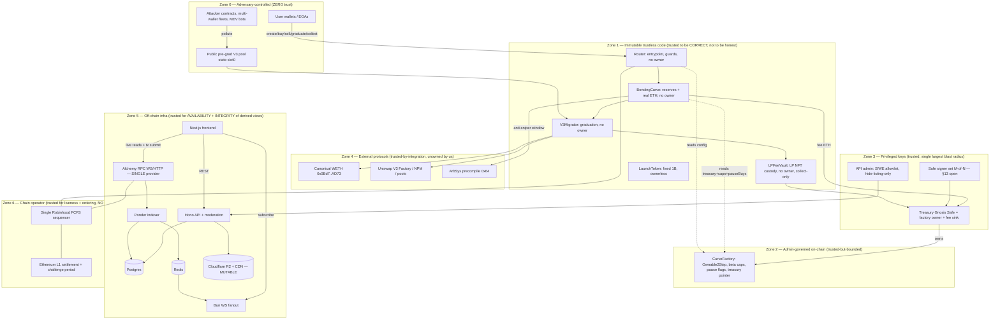

# ROBBED_ — Threat Model

**Status:** v1.0, 2026-07-09. Design-time artifact, authored **before any code exists** (spec v1.1, no implementation) so it cannot be biased by what got built. Root authority: `launchpad-spec.md`; hard rules in `CLAUDE.md`; component designs in `docs/services/`. When this doc and the spec disagree on a *defense*, the spec wins and this doc gets a PR; when this doc names a *threat the spec does not cover*, that is a finding routed to hoodpad-architect (§8 of this doc).

**Adversarial stance.** This is a refutation document, not a defense catalog. Its job is to find where funds, integrity, or the headline guarantees can break. The most load-bearing product claim — *"sells are always open; no pause authority can block a curve exit"* (spec §6.5) — is treated here as a hypothesis to be attacked, not an axiom. Section 4 and Section 6 record where that claim is in fact defeatable.

**Downstream consumers.** Gate-5 adversarial LLM prompts, gate-6 red-team scenarios, and the gate-10 known-risks doc are all derived from this file. Section 6 (residual register) is written to be liftable verbatim into gate 10. Section 7 maps every threat to the gate that verifies its mitigation.

---

## 0. The headline guarantee, stated precisely

The spec's marketing-level claim is "sells always open." The *true* guarantee, after this analysis, is narrower and must be stated as such everywhere it matters:

> A curve sell succeeds **iff** all of: (a) `phase == Trading` (not `ReadyToGraduate`, not `Graduated`); **and** (b) the single Robinhood sequencer includes the transaction. The contract contains no `pauseSells` flag, and — since the ratification of **§12.25 pull-payment fee escrow** — **the sell path makes no call to the treasury**: the fee accrues in-contract (`accruedFees`) and is withdrawn later by a permissionless, non-phase-gated `sweepFees()`. A reverting/hostile treasury can therefore no longer freeze sells (former dependency (b), UM-1, is **eliminated by construction**). Only (a) and the sequencer (b) remain as liveness dependencies outside the "no flag exists" property.

Everything in Section 4/5/6 that erodes (a) or (b) is a first-class finding. The "no flag exists" property is real and verifiable (grep + gate-2 pause matrix, now including the reverting-treasury sell case); the *liveness* of sells is weaker than the copy implies only w.r.t. the sequencer. This gap is the spine of this threat model.

---

## 1. System & trust boundaries

### 1.1 Trust-zone diagram

### 1.2 What each zone is trusted with, and what crossing a boundary means

| Zone | Trusted with | Crossing INTO it means | Crossing OUT of it means |
|---|---|---|---|
| **Z0 wallets/attackers** | nothing | n/a | any input reaching Z1 is hostile and must be validated in-contract |
| **Z1 immutable code** | holding curve ETH, LP principal, executing pricing/graduation math correctly, forever | a call must pass phase/slippage/deadline/CEI/reentrancy guards | Z1→Z4 external calls (WETH, NPM, pool swap, ArbSys) are the reentrancy + integration-integrity surface |
| **Z2 factory** | config within immutable hard caps, pause flags, cap accounting, the **treasury pointer** | only the Safe (owner) may write; only Router/curves may call privileged paths | factory→curve config is snapshotted (economics frozen) or read-live (treasury/pauseBuys/caps) — the read-live set is the admin's live reach |
| **Z3 keys** | fee custody, future-curve param tuning, listing moderation | Safe threshold signatures / SIWE session | **largest blast radius**: treasury pointer + pause flags + fee redirection. A compromised Safe is the worst on-chain case short of a Z1 code bug |
| **Z4 external** | correct WETH/NPM/pool/precompile behavior at the addresses we integrate | addresses MUST come from official registries (§13); startup fails if unset | a wrong/hostile address here = graduation mints into an attacker venue |
| **Z5 off-chain** | availability and **integrity of derived views** (candles, balances, Trust verdicts, quotes shown pre-signature) | no path may mutate chain state; API writes only moderation tables | a lying Z5 cannot steal directly (on-chain slippage bounds it) but can mis-inform a signature and defeat the Trust panel's purpose |
| **Z6 operator** | transaction inclusion, ordering (FCFS), soft-confirmation honesty, L1 posting | we submit txs and hope for inclusion | **no recourse**: censorship/reorder/equivocation are inherited, not mitigated, unless L1 force-inclusion exists (unverified, §13) |

---

## 2. Assets at risk (ranked)

| # | Asset | Where it lives | Worst-case loss | Primary guardian |
|---|---|---|---|---|
| A1 | **Curve ETH reserves** (live, per token) | `BondingCurve` balance | drained below `realEthReserves` → sellers can't be paid (insolvency) | Z1 solvency invariant `balance ≥ realEthReserves` (gate 2) |
| A2 | **User trade value in flight** | tx from wallet → curve/pool | bad fill, sandwich, front-run, mis-set slippage from a lying quote | slippage+deadline on every path (§6.5); FCFS; **but** quote source integrity (Z5/RPC) is unguarded |
| A3 | **LP principal in the vault** | `LPFeeVault`-held V3 NFT | principal extracted / liquidity decreased | vault has no `decreaseLiquidity`/`transfer`/owner (§6.3.4); collect-only |
| A4 | **Treasury fee flows** | fee ETH → treasury, V3 fees → treasury via `collect` | redirected to attacker; skimmed via rounding | in-contract fee math + exact-fee invariant (gate 2); treasury pointer is admin-mutable (Z3 risk) |
| A5 | **Graduation escrow (transient)** | curve→migrator during `graduate()`, pre-mint | hostile-ratio mint burns real ETH value into an attacker-skewed position | arb-back-or-revert, amount-mins, no-hostile-mint invariant (§6.3.2, gate 2) |
| A6 | **Metadata / image integrity** | on-chain `metadataHash` + R2 JSON/image | displayed content diverges from the on-chain commitment (image-swap) | JSON hash verified vs chain (§8.3); **image bytes NOT server-verified in v1 (OI-10)** |
| A7 | **Listing integrity / platform reputation** | indexer views, trending/KotH, moderation | wash-traded fake trending; impersonation scams; unmoderated ticker | fee cost of washing; curated watchlist; hide-listing admin — all economic/manual, not structural |
| A8 | **Admin keys** (Safe signers, SIWE allowlist) | off-chain custody | compromise → A4 redirect of *future* fee sweeps + A1 buy-freeze; **sell-freeze via treasury pointer is closed (§12.25)** | Safe M-of-N (§13 open); no on-chain upgrade/extract power by design (§6.6) |

---

## 3. Attacker catalog

| Attacker | Capabilities | Motivation | Cost | Targets |
|---|---|---|---|---|
| **Sniper / multi-wallet fleet** | submit many buys at launch across N funded wallets; cannot jump FCFS queue via priority fee | buy cheap on a fresh curve, dump | gas + N-wallet funding + `MAX_EARLY_BUY`×N; anti-sniper is per-tx not per-actor | A2, fair launch integrity |
| **Sandwich / MEV bot** | observe mempool/sequencer intake; place buy-before / sell-after | extract slippage from a victim buy | needs ordering advantage the FCFS sequencer denies to fee-bidders; residual = sequencer-side ordering | A2 |
| **Wash trader** | self-trade across owned wallets on the curve | inflate `vol24h` → top trending/KotH → attract real buyers, then dump | ~2% round-trip curve fee per wash cycle (the only brake) | A7, then A2 of others |
| **Pre-seed pool griefer** | before graduation, donate/`sync`-inflate/swap the pre-created near-empty V3 pool; mint concentrated liquidity at a hostile tick | force a hostile-ratio mint, or **lock graduation** to freeze the curve | tokens/WETH/ETH sunk into the pool (griefing is money-losing) — but the *lock* variant may be cheap (see UM-2) | A5, A1 (freeze) |
| **Malicious creator** | craft metadata; large atomic initial buy; wash to trend; dump on the curve | classic pump-and-dump / soft rug | initial-buy capital + wash fees | A2, A7 |
| **Malicious admin / compromised Safe signer(s)** | reach threshold on the Safe → `setTreasury`, pause creates/buys, retune future-curve fees | redirect *future* fee sweeps; freeze the platform's *buy* side; **can NO LONGER freeze sells** (§12.25 pull-payment — no sell-path treasury call) | compromise M-of-N signers | A4, A1 (buys) |
| **Compromised sequencer / Robinhood operator** | censor, reorder within FCFS, equivocate on soft-confirmations, downtime | censor a sell, self-sandwich, roll back a soft-confirmed trade | operator-level; no external cost | A2, sell-liveness (b/c of §0) |
| **RPC / infra attacker** (compromised Alchemy endpoint or MITM of the single provider) | feed the frontend false reserves/phase/quotes; stall the indexer | mis-inform a signature; spoof Trust panel; DoS liveness | compromise/MITM one provider (no fallback) | A2, A6, availability |
| **Indexer-poisoning attacker** | if indexer host/DB compromised: fabricate candles/balances/trending/confirmation states | manipulate discovery + Trust verdicts | host compromise | A7, A6 |
| **Phishing / impersonation attacker** | launch a token cloning a top-asset/Stock-Token ticker/name/image; ride the unmoderated launch ticker | trick buyers into a scam token | one launch (creation fee) | A7, victims' A2 |
| **Storage/CDN attacker** (R2 write access via API/ops compromise) | overwrite `images/{hash}.webp` bytes | swap displayed image while the JSON-hash Trust badge still reads "verified" (UM-6) | R2 credential compromise | A6 |

### 3.1 Observed adversaries (v1.2, spec §2.2 — these are DEPLOYED, not theoretical)

Manual mainnet tx analysis (2026-07-09, re-verify at M2 with own indexer §8.5) confirmed the sniper/wash/multi-wallet cohorts above are **live on-chain**, not hypothetical:

- **Shared-infra sniper/arb executor** — one unverified proxy (`0x65050a…`) is ~⅓ of sampled swaps, atomically pulling WETH from multiple pools in the same second, invoked by dozens of EOAs → maps to the **Sniper/arb** and **same-second multi-pool exit** attacker rows.
- **Gas-funder farm** — an EOA (`0x1887FA…`, ~1084 ETH) drip-funds ~0.0004 ETH to fresh wallets every 1–2 min → **empirically confirms the multi-wallet-bypass** of the per-tx anti-sniper cap acknowledged in spec §6.5 (the guard blunts single-tx sweeps only; per-actor evasion via wallet rotation is real).
- **Programmatic majority** — >50% of sampled swaps have `sender ≠ recipient` → chain-level activity metrics are inflated (the binding organic-flow discount, spec §2.2).

**Gate-6 red-team scenarios are parameterized against these three (spec §10 gate 6):** (a) **multi-wallet sniping from a shared gas-funder** — simulate a funder fanning out to K wallets each buying `MAX_EARLY_BUY` in the early window, and **quantify the total cost and fair-launch distortion** (the multi-wallet bypass is now a measured cost, not an assumption); (b) **same-second multi-pool exits** — an arb executor draining WETH from ≥3 graduated pools in one block, verifying no curve invariant breaks and the indexer's `arb/exit` labeling (§8.5) is correct; (c) **wash-loop volume** — self-trading clusters inflating `vol24h`, verifying the ~2% round-trip fee brake (Section 6, R10) and that §8.5 excludes wash volume from organic metrics. Gate 6 reports the attacker's minimum spend for each.

---

## 4. Threat enumeration (STRIDE per component)

Legend: **M** = mitigated (spec ref given); **UM-n** = unmitigated / under-mitigated finding (Section 8). Every gate-2 invariant is tagged where it acts as a mitigation.

### 4.1 Router
| STRIDE | Threat | Disposition |
|---|---|---|
| S (spoof) | Caller impersonates the factory/curve to trade | **M**: curve trade fns are `onlyRouter`; Router is a public entrypoint by design, no privileged identity to spoof |
| T (tamper) | Caller supplies a fee amount/recipient | **M**: no fee param exists in any signature; fees in-contract only (§4.1, CLAUDE.md hard rule) |
| T | Reentrancy via ETH `call` to trader/treasury/refundTo | **M**: `nonReentrant` on all state-mutating externals + CEI; reentry hits guard or terminal phase (§5.4). *Gate-2 invariant: no-ETH-extraction-beyond-fair-value.* |
| R (repudiation) | — | events on curve/factory; indexer records |
| I (info) | — | all data public |
| D (DoS) | `sellWithPermit` griefed by front-run permit consumption | **M**: try/catch proceeds if allowance suffices (contracts.md §5.7) |
| D | **`sellWithPermit` trade-deadline not enforced** (signature lists `nonReentrant` only, not `checkDeadline`) | **UM-8** (Low): confirm at impl the *trade* deadline is enforced, not just the permit deadline |
| E (elevation) | Router holds/strands ETH an attacker reclaims | **M**: Router has no `receive()`, never custodies ETH; curve pays recipients directly (contracts.md §2.4) |

### 4.2 BondingCurve
| STRIDE | Threat | Disposition |
|---|---|---|
| T | Rounding-direction extraction (buy/sell math skims value) | **M**: buy `ceilDiv` favors protocol, sell rounds ethOut down (§6.2). *Gate-2 invariants: k non-decreasing; no-extraction-beyond-fair-value.* |
| T | Fee off-by-one / drift vs treasury receipts | **M**: single fee site per leg; *gate-2 exact-fee-accounting invariant (== to the wei)*. |
| T | Insolvency — pay out ETH the curve doesn't hold | **M**: *gate-2 solvency invariant `balance ≥ realEthReserves`*; donations swept not credited (contracts.md §5.7). |
| T | Hostile-ratio value creation at graduation boundary | **M**: graduation clamp lands exactly on `GRADUATION_ETH`, excess refunded, `minTokensOut` still honored (§6.2). *Gate-2: graduation single-fire & reachable.* |
| S | Trade functions called by non-Router | **M**: `onlyRouter`; `graduate()` intentionally permissionless + `nonReentrant`. |
| T | `block.number`-based logic (L1 estimate on Orbit) | **M**: banned; anti-sniper uses `block.timestamp`; CI grep (§5.1, hard rule). |
| D | Sell path DoS via treasury that reverts on ETH receive | **UM-1 — RESOLVED (spec §12.25):** fixed by pull-payment fee escrow — the sell (and buy) path never calls the treasury; the fee accrues to `accruedFees` and is withdrawn by a permissionless, non-phase-gated `sweepFees()`. A reverting treasury reverts only `sweepFees()` (retriable), never a sell. Verified by the reverting-treasury sell case in the gate-2 pause matrix + solvency drain (contracts.md §6). |
| D | **Curve funds frozen in `ReadyToGraduate`** if graduation is grief-locked | **UM-2** (High): both directions lock in that phase (§12.12); if `migrate()` is forced to persistently revert, ETH is stuck → defeats §0(a). |
| D | Anti-sniper single-tx sweep | **M (bounded)**: per-tx `MAX_EARLY_BUY` in early window (§6.5); **multi-wallet bypass acknowledged** — quantify cost in gate 6. |
| E | Double-graduation / post-grad value extraction | **M**: phase terminal; *gate-2: post-grad curve holds zero value*; CEI single-fire. |
| D | Post-grad `receive()` donations become extractable | **M**: fuzzed in gate-2 invariant #5; nothing becomes extractable post-grad. |

### 4.3 V3Migrator
| STRIDE | Threat | Disposition |
|---|---|---|
| T | Pre-seeded pool at hostile price → hostile-ratio mint | **M**: `initializePool` at creation; `migrate` never trusts `slot0`, arbs back or reverts (§6.3.2). *Gate-2: donation + sync-style + swap griefing fuzzed → corrected-or-revert, never hostile mint.* |
| T | Reentrancy via `uniswapV3SwapCallback` from a fake pool | **M**: callback reverts `NotPool` unless `msg.sender == _activePool` for the in-flight migration (contracts.md §2.5). |
| D | Arb-back exceeds budget/iterations → `PoolPriceUnrecoverable` revert | **M for the mint** (never hostile), **but** feeds **UM-2**: the revert leaves the curve locked; the "economically self-healing" retry assumes external arbers who have no incentive on a near-empty pre-grad pool. |
| S | Wrong V3 Factory/NPM address (invented, not registry) | **M**: addresses from official registry only (§13/O-4); startup + fork tests fail if wrong. |
| T | Mis-ported vendored `TickMath`/`FullMath` skews graduation price/ratio | **UM-10** (Info/supply-chain): gate-4 mutation targets `CurveMath` + migrate logic; the vendored libs are graduation-critical but not explicitly in the mutation/differential scope. |
| E | Migrate callable by non-curve | **M**: `onlyCurve` via `factory.isCurve` (contracts.md §2.5). |

### 4.4 LPFeeVault
| STRIDE | Threat | Disposition |
|---|---|---|
| E | Principal extraction / liquidity decrease | **M**: no owner, no `decreaseLiquidity`/`approve`/`transfer` initiation; sole external fn `collect()` → fixed treasury (§6.3.4). Auto-fail on any added privileged path. |
| S | NFT injected from a non-NPM sender to confuse accounting | **M**: `onERC721Received` reverts unless `msg.sender == positionManager`. |
| T | `collect` recipient redirected | **M**: recipient is `immutable treasury`, set once at deploy, unchangeable. |

### 4.5 CurveFactory (admin surface)
| STRIDE | Threat | Disposition |
|---|---|---|
| E | Owner reaches into live-curve economics | **M**: economics snapshotted per curve at creation; owner setters affect future curves only; unit-tested negative property (contracts.md §7.3). |
| E | Owner pauses sells | **M**: no `pauseSells` flag exists, **and** the treasury-pointer backdoor (former UM-1) is closed by §12.25 — the sell path never calls the treasury (pull-payment), so pointing `treasury` at a reverter cannot block sells. |
| T | Owner raises fee above cap | **M**: `tradeFeeBps ≤ MAX_TRADE_FEE_BPS(200)` hard cap; fee setters bounded by immutable ceilings. |
| S | Non-owner calls setters / non-Router calls `createToken` | **M**: `onlyOwner` / `onlyRouter` / `onlyCurve`; Ownable2Step handover. |
| D | Beta caps mis-accounted, blocking buys | **M**: `recordEthDelta` decrements on sells *and graduation* (§2.2 line: "sells/graduation delta negative, never reverts"); global sum tracks live curve ETH. Sells never revert on cap (floor-at-zero). |
| E | Proxy/upgrade sneaks in | **M**: immutable, no proxies; upgrade = new factory (§6, auto-fail on violation). |
| E | CREATE2 curve-address squatting griefs a creator's next launch | **UM-9** (Low): salt = `keccak256(creator, tokenCounter)`; counter is predictable; an attacker can pre-occupy the target address to make CREATE2 revert for a specific creator. DoS-of-create only. |

### 4.6 Indexer pipeline
| STRIDE | Threat | Disposition |
|---|---|---|
| T | Fabricated logs / wrong derived state | **M (partial)**: Ponder validates against chain via RPC; **but** integrity ultimately rests on the single RPC (UM-4) and on host trust. |
| T | Reorg rolls back soft-confirmed trades inconsistently | **M**: watermarks only reference L1-posted blocks; rolled-back events were `soft_confirmed` by definition; `reorg` message drops orphans (§5.3). |
| S | Confirmation-state spoof (mark soft as finalized) | **M (host-trust)**: derived from `safe`/`finalized` RPC tags; no user input; monotonic. Residual = RPC/host trust. |
| D | Head-lag / stalled indexer → stale UI | **M**: gate-7 monitoring on head lag + publish latency; frontend degraded-mode banners. |
| I | Pre-grad pool activity leaks into price series | **M**: pre-grad V3 activity not indexed; curve is sole venue until `Graduated` (§12.16). |

### 4.7 API / moderation
| STRIDE | Threat | Disposition |
|---|---|---|
| T | Unmoderated bytes reach CDN (polyglot/CSAM) | **M**: API-mediated upload, MIME magic-byte sniff + re-encode before R2 (§8.4, §12.19). |
| T | Metadata mutation to bypass moderation | **M**: content-addressed by hash; changed bytes break the hash; indexer re-verify flips the Trust verdict. |
| T | **Image-byte swap post-launch while JSON-hash badge stays "verified"** | **UM-6** (Medium): image bytes are *carried* in the JSON, not server-verified in v1 (OI-10); R2 is mutable + ops-writable. |
| E | Admin escalates beyond hiding a listing | **M**: `/v1/admin/*` can only set listing visibility/impersonation flags; no chain-affecting path exists (§8.4). |
| S | Admin session forgery / CSRF | **M**: SIWE against allowlist, HttpOnly SameSite=strict cookie + CSRF token (§6.2). Residual = allowlist/signer-set (§13). |
| D | Search/storage/SSRF DoS | **M**: trgm floor + statement timeout, size caps + orphan sweep, no server-side fetch of user URLs (§6.3). |
| I | Impersonation token evades the watchlist | **UM-7** (Low/Med): watchlist curated + refreshed only ≥ monthly; the WS launch ticker is **unmoderated** in v1 (§12.21) — new impersonations surface immediately, unflagged for up to a refresh cycle. |

### 4.8 Frontend
| STRIDE | Threat | Disposition |
|---|---|---|
| T | **Lying RPC spoofs reserves/phase/quotes shown before signature** | **UM-4** (Medium): single Alchemy provider, no cross-check/fallback provider; on-chain slippage bounds direct theft but the Trust panel + quote integrity are only as honest as one RPC. |
| E | **Stored-`links` XSS / phishing** (`javascript:`/`data:` URIs rendered as href) | **UM-5** (Medium): API validates `links` as URL syntax and never fetches them, but no scheme allowlist / render-sanitization is specified; malicious hrefs render on Token Detail. |
| S | Optimistic row spoof / never-reconciled ghost trade | **M**: optimistic rows reconcile to indexed truth by `txHash`, never trusted-as-final, never silently promoted (web reconciliation §; §2.1 badges). |
| I | Soft-confirmed rendered as final | **M**: `ConfirmationBadge` amber→blue→green; nothing soft renders unqualified-final. |

### 4.9 Coverage check — every gate-2 invariant appears as a mitigation
- k non-decreasing → 4.2 (rounding), 4.2 (math). ✓
- solvency `balance ≥ realEthReserves` → 4.2 (insolvency). ✓
- exact fee accounting → 4.2 (fee drift), A4. ✓
- graduation single-fire & reachable → 4.2 (boundary), 4.3. ✓
- post-grad zero value → 4.2 (double-grad, donations). ✓
- pre-seed no hostile mint → 4.3 (pre-seed). ✓
- no ETH extraction beyond fair value → 4.1 (reentrancy), 4.2 (rounding). ✓

---

## 5. Sequencer & L2 trust assumptions

Robinhood Chain is an Arbitrum-Orbit optimistic rollup with a **single Robinhood-operated FCFS sequencer**. We inherit its trust properties wholesale; almost nothing here is mitigated by us.

| Property | We inherit | We mitigate | Residual |
|---|---|---|---|
| **Censorship** | sequencer may drop/refuse any tx, including a **sell** | nothing at the contract layer; "no `pauseSells` flag" does not bind the sequencer | **Sell-liveness §0(c) is void under censorship** unless Orbit L1 delayed-inbox / force-inclusion is available on 4663 — **unverified (§13)**. This is the single most important open assumption behind the exit guarantee. |
| **Reordering within FCFS** | priority fees do NOT jump the queue (spec §2) — this *reduces* generic sandwich MEV | rely on FCFS + per-tx slippage/deadline | the sequencer itself can reorder/insert; a compromised sequencer can self-sandwich with no fee signal. Not externally detectable. |
| **Downtime** | no trades/exits while the sequencer is down | none | availability risk; funds not lost but exits paused for all. |
| **Soft-confirmation reversal** | a soft-confirmed trade can vanish before L1 posting (equivocation or deep reorg) | confirmation tiers (soft→posted→finalized) surfaced in UI; large-value flows disclose posted/finalized (§2.1) | a user may act on a soft-confirmed state the operator later drops; `reorg` messages remove orphans but value acted-upon off-platform is unrecoverable. |
| **Settlement / challenge period** | L1 finality + challenge window for withdrawals | bridge/withdrawal UX discloses tier (§2.1) | standard optimistic-rollup withdrawal delay; out of our control. |

**Assumption to validate (gate 6 / gate 10):** does 4663 expose L1 force-inclusion? If **no**, the known-risks doc must state plainly that curve exits depend on sequencer cooperation, and "sells always open" is a *contract* property, not a *liveness* guarantee.

---

## 6. Residual risks register (feeds gate 10 verbatim)

R1–R10 are written to be lifted into the published known-risks doc.

- **R1 — No firm audit at launch.** Assurance = AI pipeline + capped beta + public bounty + an explicit external-review decision gate (§10). No Sherlock/Code4rena contest is guaranteed pre-caps-lift; that decision is gate 9.
- **R2 — Single sequencer.** Robinhood operates the only sequencer. Censorship, reordering, downtime, and soft-confirmation reversal are inherited (Section 5). Curve-exit liveness depends on sequencer inclusion; L1 force-inclusion availability is unverified (§13).
- **R3 — Soft-confirmation semantics.** Sub-second "soft-confirmed" trades are sequencer inclusions, not L1-final; they can reverse. UI distinguishes tiers; users must not treat soft-confirmed as settled for large value.
- **R4 — Centralized listing moderation.** Admins can hide listings (listing-only, never chain state). The launch ticker is unmoderated in v1; impersonation watchlist is manual and refreshed ≥ monthly (R9).
- **R5 — Admin (Safe) powers.** The factory owner can pause creates/buys, retune future-curve fees within caps, and repoint `treasury`. **The treasury-pointer sell-freeze (former UM-1) is closed by §12.25 pull-payment:** no trade path calls the treasury, so a malicious/compromised/misconfigured treasury can no longer freeze sells — it can at most (a) revert its own `sweepFees()` (retriable; funds safe in-contract) and (b) redirect *future* fee sweeps. Buys remain pausable by design. Safe M-of-N and signer set are open (§13).
- **R6 — Graduation-lock exposure (UM-2).** In `ReadyToGraduate` both directions lock; a pool grief that keeps `migrate()` reverting can freeze curve ETH until the pool is externally corrected — for which there may be no economic incentive on a near-empty pre-grad pool.
- **R7 — Single RPC provider (UM-4).** Frontend Trust-panel reads, quotes, and indexer ingestion all depend on one Alchemy endpoint. A compromised/MITM'd RPC can spoof displayed state and stall liveness; on-chain slippage bounds direct theft but not misinformation.
- **R8 — Image-integrity gap (UM-6).** Only the metadata JSON hash is verified against chain in v1; image bytes are not server-verified (OI-10). A mutable-R2 or ops compromise can swap a displayed image while the Trust badge still reads "verified."
- **R9 — Impersonation exposure (UM-7).** Homoglyph/impersonation detection is a curated monthly list; the unmoderated ticker gives new impersonators an immediate, if brief, surface.
- **R10 — Wash-trade-gameable discovery.** Trending/KotH volume components are gameable by self-trading; the only brake is the ~2% round-trip curve fee. No structural anti-wash mechanism exists (by design; quantified in gate 6).
- **R11 — Economic (inherent) launchpad risks.** Malicious-creator pump-and-dump, multi-wallet sniping, and value volatility are inherent to permissionless bonding curves; the curve bounds but does not prevent them.
- **R12 — Supply-chain: compiler pin + vendored math.** Exact pin `0.8.35` is unverified against the Blockscout verifier (§13/O-5); vendored `TickMath`/`FullMath` ports are graduation-critical (UM-10).

---

## 7. Coverage map — threat → verifying gate → status

All statuses are **UNVERIFIED** today (design-time, pre-implementation) — expected.

| Threat / finding | Verifying gate(s) | Status |
|---|---|---|
| Fee off-by-one / rounding extraction (4.1/4.2) | 1 (Slither), 2 (exact-fee invariant), 4 (mutation on CurveMath) | UNVERIFIED |
| k non-decreasing / solvency / no-extraction (4.2) | 2 (invariants), 4 (mutation) | UNVERIFIED |
| Reentrancy through ETH/token/NPM callbacks (4.1/4.3) | 1, 2, 5 (LLM), 6 | UNVERIFIED |
| Graduation single-fire & reachable, post-grad zero value (4.2) | 2 (invariants), 3 (fork lifecycle) | UNVERIFIED |
| Pre-seed / donation / sync / swap hostile mint (4.3) | 2 (dedicated fuzz), 3 (fork pollute-then-graduate), 6 (end-to-end grief) | UNVERIFIED |
| `block.number` usage anywhere (4.2) | 1 (CI grep), 6 (trace) | UNVERIFIED |
| Anti-sniper cap + multi-wallet bypass cost (4.2) | 6 (sniper sim, **parameterized vs the observed shared-funder farm §2.2/§3.1** — bypass now empirically confirmed, sim quantifies cost) | UNVERIFIED |
| Sandwich residual under FCFS (A2) | 6 (sandwich sim) | UNVERIFIED |
| Wash-trade / trending gameability, R10 (4.7) | 6 (wash sim, **parameterized vs observed wash-loop volume §2.2/§3.1**; §8.5 excludes wash from organic metrics) | UNVERIFIED |
| Same-second multi-pool arb exits (§3.1) | 6 (arb-exit sim); §8.5 `arb/exit` labeling | UNVERIFIED |
| **UM-1 treasury-set sell-freeze — RESOLVED (§12.25 pull-payment)** (4.2/4.5/R5) | 2 (pause matrix now includes the reverting-treasury sell case + reverting-treasury solvency drain — contracts.md §6), 7 (kill-switch inspection) | UNVERIFIED (design fixed; test added to gate-2 — the §7 "needs an explicit test" gap is closed by the new pause-matrix case) |
| **UM-2 graduation-lock freeze** (4.2/4.3/R6) | 2 (grief fuzz reachability), 6 (grief-then-retry economics) | UNVERIFIED — **gap: liveness/escape not proven** |
| Beta cap enforced in code (4.5) | 7 (config inspection) | UNVERIFIED |
| No sell-block / no post-grad pause authority (4.2/4.5) | 7 (code inspection), 2 (pause matrix) | UNVERIFIED |
| **UM-3/R2 sequencer censorship vs sell-liveness** (§5) | 6 (assumption test), 10 (disclosure) | UNVERIFIED — **gap: force-inclusion unconfirmed** |
| **UM-4/R7 single-RPC integrity** (4.8/4.6) | 6, 10 (disclosure); no code gate | UNVERIFIED — **infra, no current gate** |
| **UM-5 stored-link XSS/phishing** (4.8) | (web e2e/CSP — not a §10 gate) | UNVERIFIED — **gap: no §10 gate owns this** |
| **UM-6/R8 image-integrity** (4.7) | 10 (disclosure); OI-10 deferred | UNVERIFIED — **accepted deferral** |
| **UM-7/R9 impersonation/unmoderated ticker** (4.7) | 10 (disclosure) | UNVERIFIED — **accepted** |
| **UM-8 sellWithPermit deadline** (4.1) | 1, 2 (unit) | UNVERIFIED |
| **UM-9 CREATE2 squatting** (4.5) | 2/3 (unit/fork) | UNVERIFIED |
| **UM-10 vendored math** (4.3/R12) | 4 (extend mutation scope), 3 (fork tick math) | UNVERIFIED — **gap: extend gate-4 targets** |
| Vault principal lock (4.4) | 1, 2, 5 | UNVERIFIED |
| Admin cannot reach live curves (4.5/R5) | 2 (negative-property units), 5 | UNVERIFIED |
| Metadata JSON hash integrity (4.7) | (indexer verify tests) | UNVERIFIED |

### 7.1 Coverage-map completion (2026-07-09, finding T-5)

The rows above omitted ~1/3 of the §4 STRIDE threats; gate authors (5/6/10) must not skip them. The previously-unmapped threats and their verifying gate:

| Threat / finding (§4) | Verifying gate(s) | Status |
|---|---|---|
| Caller impersonates factory/curve (4.1 S) | 1 (access-control), 2 (`onlyRouter`/`onlyCurve` units) | UNVERIFIED |
| Caller-supplied fee/recipient (4.1 T) | 1, 2 (no fee param exists — signature + grep `checkFee`/`feeAmount`) | UNVERIFIED |
| Router strands ETH / has `receive()` (4.1 E) | 2 (no-`receive` unit; Router holds no ETH) | UNVERIFIED |
| Migrator fake-pool callback reentrancy (4.3 T) | 2 (`NotPool` unit), 3 (fork) | UNVERIFIED |
| **Cross-entrypoint reentrancy** (refund→`graduate()`/`sweepFees()`) (§8.1) | 2 (nonReentrant + CEI units, invariant 7) | UNVERIFIED — **M1 obligation** |
| Vault NFT injected by non-NPM (4.4 S) | 2 (`onERC721Received` reverts non-NPM unit) | UNVERIFIED |
| Vault `collect` recipient redirect (4.4 T) | 1, 2 (immutable-treasury unit) | UNVERIFIED |
| Owner raises fee above cap (4.5 T) | 2 (ceiling setter reverts) | UNVERIFIED |
| Indexer fabricated logs / wrong derived state (4.6 T) | host-trust + single-RPC (UM-4); indexer integration replay tests | UNVERIFIED |
| Reorg rollback of soft-confirmed (4.6 T) | M2 confirmation/reorg unit suite (indexer.md §5.3/§9.1) | UNVERIFIED |
| Confirmation-state spoof (4.6 S) | host-trust; monotonicity unit | UNVERIFIED |
| Head-lag / stalled indexer (4.6 D) | 7 (gate-7 head-lag alert) | UNVERIFIED |
| Unmoderated bytes reach CDN (4.7 T) | M2 upload hostile-fixture suite (api.md §8) | UNVERIFIED |
| Metadata mutation to bypass moderation (4.7 T) | M2 re-verify suite; content-addressing | UNVERIFIED |
| Admin escalates beyond hide-listing (4.7 E) | M2 route-inventory test (no chain-write capability) | UNVERIFIED |
| Admin session forgery / CSRF (4.7 S) | M2 SIWE session + CSRF units | UNVERIFIED |
| Search / storage / SSRF DoS (4.7 D) | M2 rate-limit + statement-timeout + orphan-sweep tests | UNVERIFIED |
| Optimistic row spoof / never-reconciled ghost (4.8 S) | M3 `trade-reducer` reconcile-by-txHash unit; e2e optimistic→reconcile | UNVERIFIED |
| Soft-confirmed rendered as final (4.8 I) | M3 `badge.test.tsx`; copy-lint | UNVERIFIED |

All statuses UNVERIFIED (design-time). Gate-5 (LLM) and gate-6 (red-team) prompt sets are derived from the **full** §4 enumeration, not only the rows above the addendum.

---

## 8. Findings routed to hoodpad-architect (disposition required)

Ordered by severity. UM-1, UM-2, UM-3 are the ones that erode the §0 headline guarantee and should be dispositioned before M1 freeze.

- **UM-1 — Critical — RESOLVED (spec §12.25, 2026-07-09) — Treasury-pointer sell-freeze backdoor.** *Original finding:* every curve sell paid the fee to the factory `treasury` via a revert-on-failure `call` before paying the seller, so an owner/compromised-signer/buggy-module could freeze all sells by pointing `treasury` at a reverter — a de-facto `pauseSells`. *Disposition:* **pull-payment fee escrow** (candidate (a) — the cleanest). `BondingCurve` never calls the treasury on any trade path; the 1% fee accrues to `accruedFees` and is withdrawn by a permissionless, non-phase-gated `sweepFees()` (mirrors `LPFeeVault.collect()`). Solvency invariant → `balance ≥ realEthReserves + accruedFees`; exact-fee → `treasuryReceipts + accruedFees == Σ fees`. Sells are now un-freezable **by construction**; §0(b) treasury dependency eliminated. **New M1 obligation on hoodpad-contracts:** implement `sweepFees()` + `accruedFees`, add the reverting-treasury sell test to the gate-2 pause matrix and the reverting-treasury solvency-drain (contracts.md §6). The migrator's flat graduation-fee push to treasury still exists (graduate() is not a sell path) — see UM-2.

- **UM-2 — High — DISPOSITIONED (2026-07-09) — Graduation-lock fund freeze.** `ReadyToGraduate` locks both directions (§12.12); a pool grief that keeps `migrate()`'s bounded arb-back from reaching `target ± TOLERANCE_TICKS` reverts `graduate()` (`PoolPriceUnrecoverable`) with real ETH inside; a reverting treasury on the graduation-fee push (still a push — §12.25 scopes to trade paths only) is a second lock vector. *Disposition (architect):* **(i)** gate 6 MUST compute and prove a bounded griefing-cost analysis — the attacker's minimum spend to sustain the lock vs `GRADUATION_ETH` — documented in the gate-6 register; the arb-back captures attacker-donated funds, so griefing is expected to be strictly money-losing, but this must be *proven*, not asserted. **(ii) M1 design task for hoodpad-contracts (decide-it-yourself protocol):** design and prove either (a) that the frozen state is unreachable within the arb budget, **or** (b) a **bounded-retry + permissionless escape hatch** (e.g., after a timestamp timeout, a permissionless path that re-opens sells / re-attempts into a corrected pool) — hoodpad-contracts owns the mechanism choice and records it in contracts.md, escalating to §12 only if it changes a product guarantee. **Flag:** if the cost analysis in (i) cannot show griefing is always uneconomic, the escape hatch (ii-b) becomes mandatory before caps-lift. For the graduation-fee-push leg, also evaluate accruing the graduation fee (pull) rather than pushing, so a reverting treasury cannot block `graduate()` either.

- **UM-3 — Medium(High if no force-inclusion) — Sequencer censorship defeats sell-liveness.** The contract-level exit guarantee is meaningless if the single sequencer censors the sell tx (§5). Whether 4663 exposes L1 delayed-inbox/force-inclusion is unverified (§13). Disposition: verify force-inclusion at M1/gate-6; state the true dependency in gate 10.

- **UM-4 — Medium — Single-RPC integrity.** Frontend Trust panel, quotes, and the indexer depend on one Alchemy endpoint with no cross-check/fallback provider. Disposition: add a second independent RPC for Trust-panel/quote cross-verification, or disclose in gate 10 that displayed state is single-source.

- **UM-5 — Medium — Stored-link XSS/phishing.** `links` from metadata are validated as URL syntax but no scheme allowlist / render sanitization is specified; `javascript:`/`data:` hrefs render on Token Detail. Disposition: enforce an `https:`-only scheme allowlist + `rel=noopener noreferrer` + CSP; owned by hoodpad-frontend/api. No §10 gate currently covers frontend injection — consider adding one.

- **UM-6 — Medium — Image-integrity gap.** JSON hash is chain-verified; image bytes are not server-verified in v1 (OI-10), and R2 is mutable/ops-writable. Disposition: either promote server-side image-hash verification out of OI-10, or disclose in gate 10 (currently accepted-deferral).

- **UM-7 — Low/Medium — Impersonation exposure.** Monthly manual watchlist + unmoderated launch ticker. Disposition: accepted risk; ensure gate-10 disclosure and consider ticker-level impersonation checks.

- **UM-8 — Low — `sellWithPermit` deadline.** Confirm the trade deadline (not just the permit deadline) is enforced; the signature lists only `nonReentrant`.

- **UM-9 — Low — CREATE2 curve-address squatting.** Predictable `salt = keccak256(creator, tokenCounter)` lets an attacker pre-occupy a specific creator's next curve address, reverting their launch (DoS-of-create). Disposition: mix in `block.timestamp`/a nonce/`msg.sender`-entropy, or accept + document.

- **UM-10 — Info/Supply-chain — Vendored math not in mutation scope.** `TickMath`/`FullMath` ports are graduation-critical but gate-4 targets `CurveMath` + migrate logic. Disposition: extend gate-4 mutation and add differential tests vs upstream Uniswap outputs.

### 8.1 Ratification-pass dispositions (2026-07-09)

- **UM-1 → RESOLVED** — pull-payment fee escrow (spec §12.25). See the UM-1 entry above.
- **UM-2 → DISPOSITIONED** — griefing-cost proof (gate 6) + bounded-retry/permissionless-escape-hatch as an **M1 design task on hoodpad-contracts**; escape hatch becomes mandatory if the cost analysis can't prove griefing is uneconomic. See the UM-2 entry above.
  - **UM-2 / M-10-A (2026-07-10) — token-leg freeze PARTIALLY CLOSED (Part 1) + residual escalated (Part 2).** The gate M1-10 review found UM-2 *realised* on the **token** leg: the arb-back's token-leg budget was `balanceOf(token) − LP_TOKEN_TRANCHE` ≈ dust at graduation, so a token-**overpriced** pool gave ≈0 token budget → `ArbBudgetExceeded` → `graduate()` reverted → curve frozen in `ReadyToGraduate` (§12.12) while the attacker held a withdrawable concentrated-LP position (money-neutral freeze; "griefing is uneconomic" failed on the token side). **Part 1 (FIXED, hoodpad-contracts, guarantee-preserving):** the token leg now has a **symmetric** `MIGRATION_SLIPPAGE_BPS`-bounded budget mirroring the WETH leg (draw down to `LP_TOKEN_TRANCHE·(1−bps)`; `amount0Min`/`amount1Min` re-enforce the parity floor). Token-side mispricing **within the slippage-recoverable range now self-corrects and graduates within tolerance** — proven by gate-2 invariant-6 liveness coverage (`ghost_tokenLegLivenessGraduations>0`) + directed regressions `test_M10A_tokenLegGrief_recoverable_graduates` / `_largerRecoverable_graduates` (pre-fix: `ArbBudgetExceeded`; post-fix: graduate). Contracts.md §3.4 step 5 (M-10-A note) + V3Migrator decision #2 updated. **Part 2 (RESIDUAL — OPEN, escalated to hoodpad-architect):** mispricing pushed *beyond* the slippage-recoverable range still reverts `graduate()` (retriable once the pool corrects, but frozen while a large hostile position persists). Symmetric budgets do NOT close this. Closing it is the **UM-2 caps-lift disposition** and is **spec-level, not hoodpad-contracts' to decide**: either **(a)** a gate-6 economic proof that sustaining such a position is prohibitively expensive (attacker locked-capital + arb-loss vs frozen `GRADUATION_ETH`), or **(b)** a permissionless escape hatch — which, if it re-opens sells during `ReadyToGraduate`, **mutates the §12.12 two-way-lock guarantee (user-facing)** and requires architect + user ratification. **Do not implement any §12.12-touching hatch without ratification.** This residual remains an **open UM-2 caps-lift item**.
- **O-8 arb-back WETH-leg budget (finding T-2) → M1 IMPLEMENTATION-DECISION on hoodpad-contracts.** The spec's budget rule ("arb spend may only consume inventory above what the target-price mint requires", §13 note) is well-defined for the **token** leg but **undefined for the WETH leg**, because the mint consumes *all* remaining WETH — "inventory above mint requirement" has no positive value on that side. Disposition (decide-it-yourself protocol): hoodpad-contracts **owns the precise definition** of the WETH-side budget (candidates: allow the WETH arb to draw against the raised WETH up to a `MIGRATION_SLIPPAGE_BPS`-bounded value-skew cap, since the arb-back and the mint are one atomic operation; or cap it by a dedicated `maxWethArbBps` immutable) and MUST **prove** the chosen rule in the gate-2 pre-seed fuzz campaign (invariant 6: value-skew at mint ≤ tolerance for both under- and over-priced pools) and quantify the $69k-parity impact in gate 6. Record the rule in contracts.md §3.4 step 5; escalate to §12 only if it changes a stated guarantee.
- **Cross-entrypoint reentrancy (finding T-3) → M1 CONTRACTS OBLIGATION.** The refund/ETH-send callbacks in a buy can reenter the permissionless `graduate()` (and now `sweepFees()`) mid-flow. Obligation on hoodpad-contracts, verified in gate 2: **all curve trade functions (`buy`, `sell`, `sellWithPermit` path) are `nonReentrant`**, `graduate()` and `sweepFees()` are `nonReentrant`, and CEI holds (phase/`accruedFees`/reserves written before any external call) so a reentrant `graduate()` hits the guard or the terminal-phase check and a reentrant `sweepFees()` sees `accruedFees == 0`. The gate-2 no-ETH-extraction invariant (#7) and the reentrancy unit tests (contracts.md §5.4) cover this; add an explicit cross-entrypoint reentrancy unit (refund callback → `graduate()`; fee-recipient callback → `sweepFees()`).
- **UM-4 (single-RPC) → ACCEPTED for v1 + gate-10 disclosure.** A second independent RPC for Trust-panel/quote cross-verification is a **pre-caps-lift enhancement** (§11 roadmap), not an M3 blocker; v1 discloses single-source displayed state in the known-risks doc (R7).
- **UM-5 (stored-link XSS) → M3 OBLIGATION on hoodpad-frontend + api.** Enforce an **`https:`-only scheme allowlist** on `links` (reject `javascript:`/`data:`/others) at the API (`POST /v1/metadata` validation) AND render with `rel="noopener noreferrer"` under a strict CSP on Token Detail; add to web.md §5 copy/render rules and api.md link validation. No §10 gate owns frontend injection today — add a Playwright XSS-render assertion to the web e2e suite (in-goal) and note the gap for gate-5/6 scope (not a new §10 gate in v1).
- **UM-9 (CREATE2 squatting) → hoodpad-contracts M1 DECISION (low).** DoS-of-create only. Recommended: accept + document (an attacker cannot cheaply target a *specific* creator because `salt = keccak256(creator, tokenCounter)` mixes the **global** monotonic `tokenCounter`, which the creator's launch ordering determines, not the attacker); if front-running proves cheap in gate 6, mix an extra nonce into the salt. hoodpad-contracts records the choice in contracts.md.

---

## 9. Maintenance

This is a living design artifact. Every contract diff review (per the adversarial protocol) that surfaces a new attack class appends a threat here first, then a test. When an UM-n is dispositioned, record the resolution in spec §12 and flip its Section-7 status once the verifying gate passes. When the spec changes a defense, this doc gets a PR — the spec wins.
